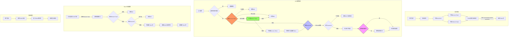

```mermaid
flowchart TD
    subgraph 登录流程
    A[用户登录] --> B[验证身份]
    B --> C[生成sessionId]
    C --> D[生成Access Token]
    C --> E[生成Refresh Token]
    D --> F[Redis存储会话信息]
    E --> F
    F -->|SET user:session:userId sessionId| G[返回Token对]
    end

    subgraph API请求验证
    H[API请求] --> I{是否白名单接口?}
    I -->|是| J[直接放行]
    I -->|否| K{验证Access Token}
    
    K -->|签名无效| L[返回401]
    K -->|已过期| M[返回401]
    K -->|成功| N{验证sessionId}
    K -->|即将过期| O[检查Refresh Token]
    
    O -->|无效| L
    O -->|有效| P[生成新Access Token]
    P --> Q[在响应头设置新Token]
    Q --> N
    
    N -->|从Redis获取| R{比对sessionId}
    R -->|不匹配| S[返回403 会话失效]
    R -->|匹配| T[注入用户信息]
    
    T --> U{是否敏感操作?}
    U -->|是| V[额外身份验证]
    U -->|否| W[处理业务请求]
    V --> W
    end

    subgraph Token主动续期
    X[前端发现Token过期] -->|携带Refresh Token| Y[调用续期接口]
    Y --> Z{验证Refresh Token}
    Z -->|无效| AA[返回401]
    Z -->|有效| AB{验证sessionId}
    AB -->|不匹配| AC[返回403]
    AB -->|匹配| AD[生成新Token对]
    AD --> AE[更新Redis会话时间]
    AE --> AF[返回新Token对]
    end

    subgraph 登出处理
    AG[用户登出] --> AH[清除Redis会话]
    AH --> AI[加入Token黑名单]
    AI --> AJ[返回登出成功]
    end

    style K fill:#f96,stroke:#333,stroke-width:2px
    style N fill:#bbf,stroke:#333,stroke-width:2px
    style O fill:#9f6,stroke:#333,stroke-width:2px
    style U fill:#f9f,stroke:#333,stroke-width:2px
```