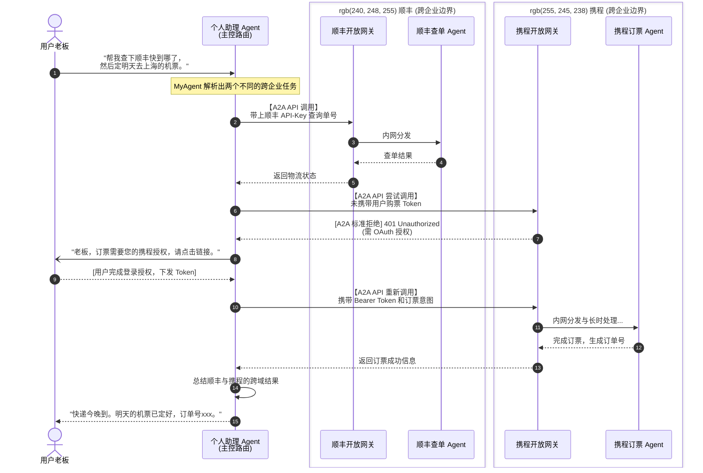

```mermaid
sequenceDiagram
    autonumber
    
    actor User as 用户老板
    participant MyAgent as 个人助理 Agent<br/>(主控路由)
    
    box rgb(240, 248, 255) 顺丰 (跨企业边界)
        participant SF_Gateway as 顺丰开放网关
        participant SF_Agent as 顺丰查单 Agent
    end
    
    box rgb(255, 245, 238) 携程 (跨企业边界)
        participant Ctrip_Gateway as 携程开放网关
        participant Ctrip_Agent as 携程订票 Agent
    end

    %% 意图识别与跨域发现
    User ->> MyAgent: "帮我查下顺丰快到哪了，<br/>然后定明天去上海的机票。"
    note over MyAgent: MyAgent 解析出两个不同的跨企业任务
    
    %% 跨域调用A：基于 API-Key 的简单服务
    MyAgent ->> SF_Gateway: 【A2A API 调用】<br/>带上顺丰 API-Key 查询单号
    SF_Gateway ->> SF_Agent: 内网分发
    SF_Agent -->> SF_Gateway: 查单结果
    SF_Gateway -->> MyAgent: 返回物流状态
    
    %% 跨域调用B：需要用户深度授权的服务 (Oauth 2.0)
    MyAgent ->> Ctrip_Gateway: 【A2A API 尝试调用】<br/>未携带用户购票 Token
    Ctrip_Gateway -->> MyAgent: [A2A 标准拒绝] 401 Unauthorized <br/> (需 OAuth 授权)
    
    MyAgent -) User: "老板，订票需要您的携程授权，请点击链接。"
    User -->> MyAgent: [用户完成登录授权，下发 Token]
    
    MyAgent ->> Ctrip_Gateway: 【A2A API 重新调用】<br/>携带 Bearer Token 和订票意图
    Ctrip_Gateway ->> Ctrip_Agent: 内网分发与长时处理...
    Ctrip_Agent -->> Ctrip_Gateway: 完成订票，生成订单号
    Ctrip_Gateway -->> MyAgent: 返回订票成功信息
    
    %% 最终整合
    MyAgent ->> MyAgent: 总结顺丰与携程的跨域结果
    MyAgent -->> User: "快递今晚到。明天的机票已定好，订单号xxx。"

```