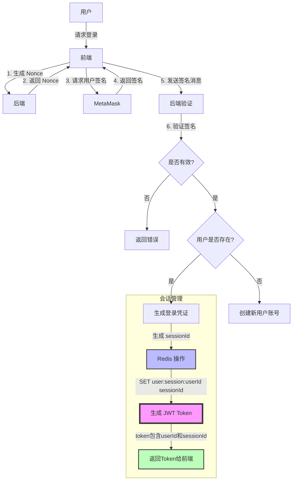

```mermaid

flowchart TD
	A[用户] -->|请求登录| B[前端]
	B -->|1. 生成 Nonce| C[后端]
	C -->|2. 返回 Nonce| B
	B -->|3. 请求用户签名| D[MetaMask]
	D -->|4. 返回签名| B
	B -->|5. 发送签名消息| E[后端验证]
	E -->|6. 验证签名| F{是否有效?}
	F -->|否| G[返回错误]
	F -->|是| H{用户是否存在?}
	H -->|否| I[创建新用户账号]
	H -->|是| P[生成登录凭证]
	
subgraph 会话管理
	P -->|生成 sessionId| Q[Redis 操作]
	Q -->|SET user:session:userId sessionId| R[生成 JWT Token]
	R -->|token包含userId和sessionId| S[返回Token给前端]
end


style R fill:#f9f,stroke:#333,stroke-width:4px
style Q fill:#bbf,stroke:#333,stroke-width:2px
style S fill:#bfb,stroke:#333,stroke-width:2px

```