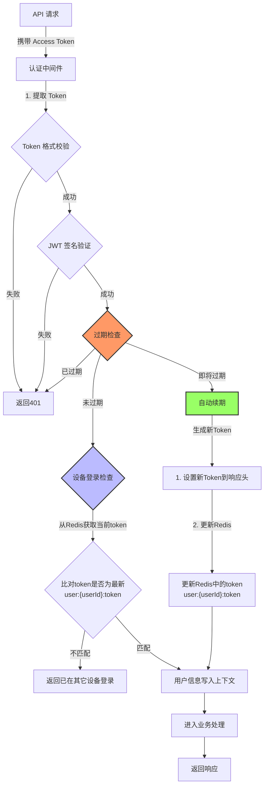

```mermaid
flowchart TD
    A[API 请求] -->|携带 Access Token| B[认证中间件]
    B -->|1. 提取 Token| C{Token 格式校验}
    C -->|失败| D[返回401]
    C -->|成功| E{JWT 签名验证}
    E -->|失败| D
    E -->|成功| F{过期检查}
    
    F -->|已过期| D
    F -->|即将过期| G[自动续期]
    F -->|未过期| H{设备登录检查}
    
    H -->|从Redis获取当前token| I{"比对token是否为最新
    user:{userId}:token"}
    I -->|不匹配| J[返回已在其它设备登录]
    I -->|匹配| K[用户信息写入上下文]
    K --> L[进入业务处理]
    L --> N[返回响应]
    
    G -->|生成新Token| M[1. 设置新Token到响应头]
    M -->|2. 更新Redis| O["更新Redis中的token
    user:{userId}:token"]
    O --> K

    style F fill:#f96,stroke:#333,stroke-width:2px
    style H fill:#bbf,stroke:#333,stroke-width:2px
    style G fill:#9f6,stroke:#333,stroke-width:2px
```