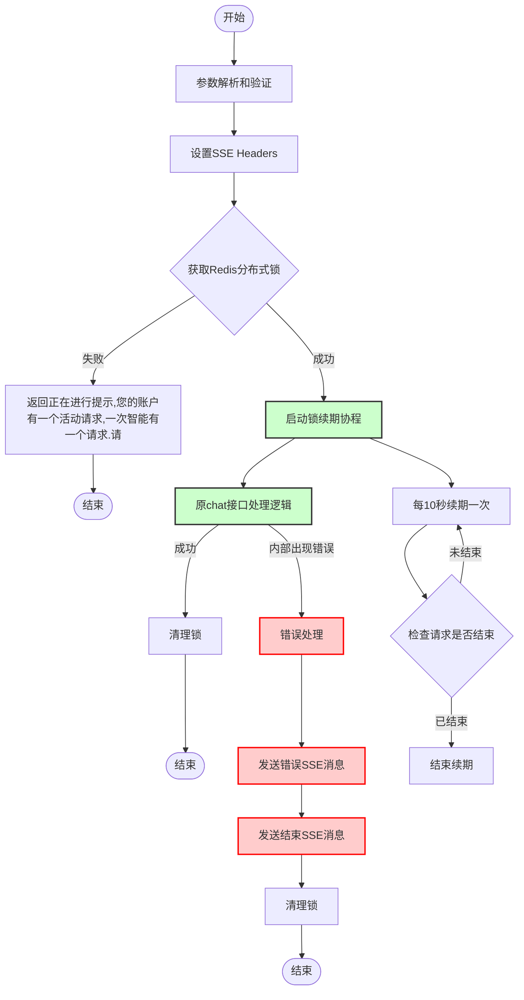

```mermaid
flowchart TD
    Start([开始]) --> A[参数解析和验证]
    A --> B[设置SSE Headers]
    B --> C{获取Redis分布式锁}
    
    C -->|失败| D[返回正在进行提示,您的账户有一个活动请求,一次智能有一个请求.请]
    D --> End1([结束])
    
    C -->|成功| E[启动锁续期协程]
    E --> F[原chat接口处理逻辑]
    
    F -->|内部出现错误| G[错误处理]
     %% 正常结束流程
    F -->|成功| N[清理锁]
    N --> End3([结束])
    
    %% 错误处理流程
    G --> K[发送错误SSE消息]
    K --> L[发送结束SSE消息]
    L --> M[清理锁]
    M --> End2([结束])
    
    %% 锁续期协程
    E --> O[每10秒续期一次]
    O --> P{检查请求是否结束}
    P -->|未结束| O
    P -->|已结束| Q[结束续期]
    
    classDef error fill:#ffcccc,stroke:#ff0000,stroke-width:2px
    classDef normal fill:#ccffcc,stroke:#333,stroke-width:2px
    class G,K,L error
    class E,F,I,J normal
```