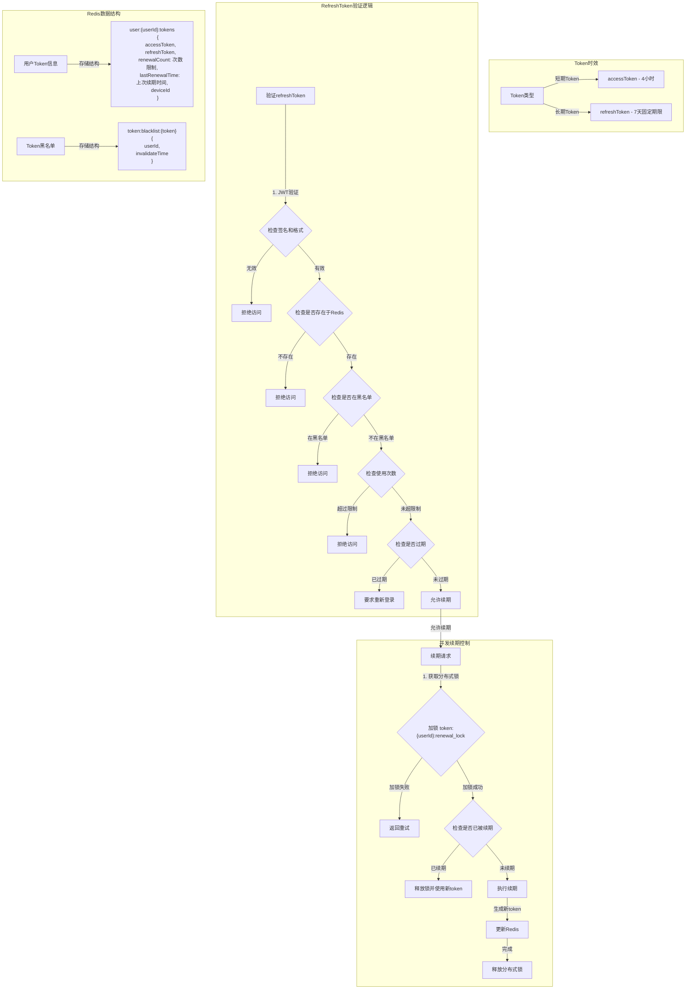

```mermaid
flowchart TD
    subgraph Token时效
        A[Token类型] -->|短期Token| B[accessToken - 4小时]
        A -->|长期Token| C[refreshToken - 7天固定期限]
    end

    subgraph RefreshToken验证逻辑
        D[验证refreshToken] -->|1. JWT验证| E{检查签名和格式}
        E -->|无效| E1[拒绝访问]
        E -->|有效| F{检查是否存在于Redis}
        F -->|不存在| F1[拒绝访问]
        F -->|存在| G{检查是否在黑名单}
        G -->|在黑名单| G1[拒绝访问]
        G -->|不在黑名单| H{检查使用次数}
        H -->|超过限制| H1[拒绝访问]
        H -->|未超限制| I{检查是否过期}
        I -->|已过期| I1[要求重新登录]
        I -->|未过期| J[允许续期]
    end

    subgraph 并发续期控制
        K[续期请求] -->|1. 获取分布式锁| L{"加锁 token:{userId}:renewal_lock"}
        L -->|加锁失败| M[返回重试]
        L -->|加锁成功| N{检查是否已被续期}
        N -->|已续期| O[释放锁并使用新token]
        N -->|未续期| P[执行续期]
        P -->|生成新token| Q[更新Redis]
        Q -->|完成| R[释放分布式锁]
    end

    subgraph Redis数据结构
        S[用户Token信息] -->|存储结构| T["user:{userId}:tokens
        {
            accessToken,
            refreshToken,
            renewalCount: 次数限制,
            lastRenewalTime: 上次续期时间,
            deviceId
        }"]
        
        U[Token黑名单] -->|存储结构| V["token:blacklist:{token}
        {
            userId,
            invalidateTime
        }"]
    end

    J -->|允许续期| K
```