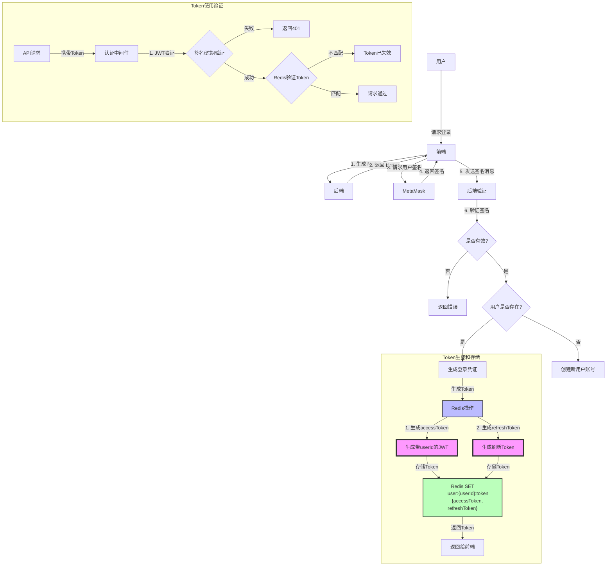

```mermaid
flowchart TD
    A[用户] -->|请求登录| B[前端]
    B -->|1. 生成 Nonce| C[后端]
    C -->|2. 返回 Nonce| B
    B -->|3. 请求用户签名| D[MetaMask]
    D -->|4. 返回签名| B
    B -->|5. 发送签名消息| E[后端验证]
    E -->|6. 验证签名| F{是否有效?}
    F -->|否| G[返回错误]
    F -->|是| H{用户是否存在?}
    H -->|否| I[创建新用户账号]
    H -->|是| P[生成登录凭证]
    
    subgraph Token生成和存储
        P -->|生成Token| Q[Redis操作]
        Q -->|1. 生成accessToken| R1[生成带userId的JWT]
        Q -->|2. 生成refreshToken| R2[生成刷新Token]
        R1 & R2 -->|存储Token| S1["Redis SET
        user:{userId}:token
        {accessToken, refreshToken}"]
        S1 -->|返回Token| T[返回给前端]
    end

    subgraph Token使用验证
        U[API请求] -->|携带Token| V[认证中间件]
        V -->|1. JWT验证| W{签名/过期验证}
        W -->|失败| X[返回401]
        W -->|成功| Y{Redis验证Token}
        Y -->|不匹配| Z[Token已失效]
        Y -->|匹配| AA[请求通过]
    end

style Q fill:#bbf,stroke:#333,stroke-width:2px
style R1 fill:#f9f,stroke:#333,stroke-width:4px
style R2 fill:#f9f,stroke:#333,stroke-width:4px
style S1 fill:#bfb,stroke:#333,stroke-width:2px
```