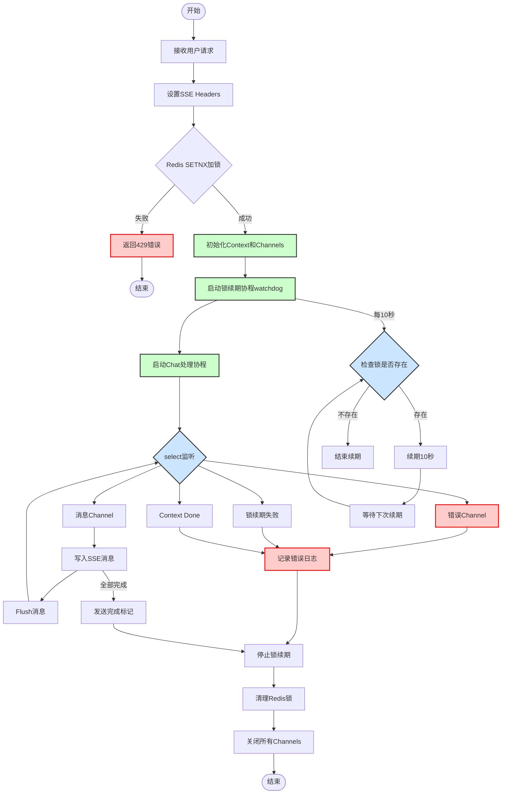

```mermaid
flowchart TD
    Start([开始]) --> A[接收用户请求]
    A --> B[设置SSE Headers]
    B --> C{Redis SETNX加锁}
    
    %% 加锁失败流程
    C -->|失败| D[返回429错误]
    D --> End1([结束])
    
    %% 加锁成功流程
    C -->|成功| E[初始化Context和Channels]
    E --> F[启动锁续期协程watchdog]
    F --> G[启动Chat处理协程]
    
    %% 并行监听流程
    G --> H{select监听}
    H --> I[Context Done]
    H --> J[消息Channel]
    H --> K[错误Channel]
    H --> L[锁续期失败]
    
    %% 消息处理
    J --> M[写入SSE消息]
    M --> N[Flush消息]
    N --> H
    
    %% 错误处理
    K --> O[记录错误日志]
    L --> O
    I --> O
    O --> P[停止锁续期]
    P --> Q[清理Redis锁]
    Q --> R[关闭所有Channels]
    R --> End2([结束])
    
    %% 正常结束流程
    M -->|全部完成| S[发送完成标记]
    S --> P
    
    %% 续期协程
    F -->|每10秒| T{检查锁是否存在}
    T -->|存在| U[续期10秒]
    U --> V[等待下次续期]
    V --> T
    T -->|不存在| W[结束续期]
    
    %% 样式定义
    classDef error fill:#ffcccc,stroke:#ff0000,stroke-width:2px
    classDef normal fill:#ccffcc,stroke:#333,stroke-width:2px
    classDef monitor fill:#cce5ff,stroke:#333,stroke-width:2px
    
    class D,O,K error
    class E,F,G normal
    class H,T monitor
```