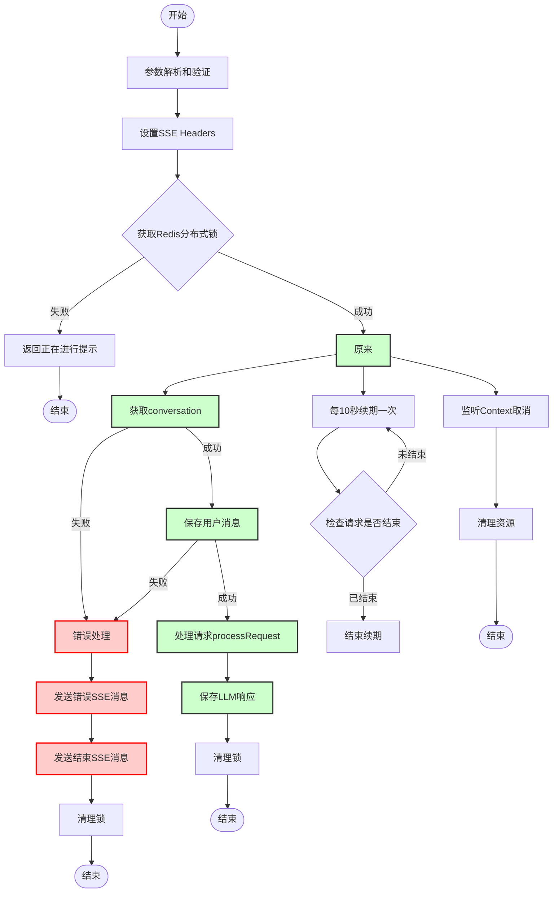

```mermaid
flowchart TD
    Start([开始]) --> A[参数解析和验证]
    A --> B[设置SSE Headers]
    B --> C{获取Redis分布式锁}
    
    C -->|失败| D[返回正在进行提示]
    D --> End1([结束])
    
    C -->|成功| E[原来]
    E --> F[获取conversation]
    
    F -->|失败| G[错误处理]
    F -->|成功| H[保存用户消息]
    
    H -->|失败| G[错误处理]
    H -->|成功| I[处理请求processRequest]
    
    I --> J[保存LLM响应]
    
    %% 错误处理流程
    G --> K[发送错误SSE消息]
    K --> L[发送结束SSE消息]
    L --> M[清理锁]
    M --> End2([结束])
    
    %% 正常结束流程
    J --> N[清理锁]
    N --> End3([结束])
    
    %% 锁续期协程
    E --> O[每10秒续期一次]
    O --> P{检查请求是否结束}
    P -->|未结束| O
    P -->|已结束| Q[结束续期]
    
    %% Context取消监听
    E --> R[监听Context取消]
    R --> S[清理资源]
    S --> End4([结束])
    
    classDef error fill:#ffcccc,stroke:#ff0000,stroke-width:2px
    classDef normal fill:#ccffcc,stroke:#333,stroke-width:2px
    class G,K,L error
    class E,F,H,I,J normal
```