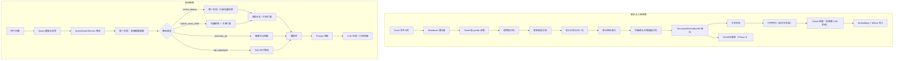

```mermaid
flowchart TD
    subgraph Ingest["解析与入库链路"]
        A["Excel 文件上传"] --> B["Workbook 预扫描"]
        B --> C["Sheet 级 profile 收集"]
        C --> D["逻辑表识别"]
        D --> D1["表格类型分类"]
        D1 --> E["表头识别与归一化"]
        E --> F["单元格标准化"]
        F --> G["列画像与主键候选识别"]
        G --> H["StructuredParseBundle 输出"]
        H --> I["关系发现"]
        I --> J["行序列化（双文本生成）"]
        J --> K["Chunk 构建（含摘要 LLM 生成）"]
        K --> L["Embedding + Milvus 写入"]
        H --> M["DuckDB 建表（Phase 3）"]
    end

    subgraph Query["查询链路"]
        Q1["用户问题"] --> Q2["Query 理解与改写"]
        Q2 --> Q3["QueryRouterService 路由"]
        Q3 --> Q4["第一阶段：表级摘要缩圈"]
        Q4 --> Q5{"路由类型"}
        Q5 -->|"vector_lookup"| Q6["第二阶段：行级向量检索"]
        Q5 -->|"summary_qa"| Q7["摘要节点检索"]
        Q5 -->|"sql_aggregate"| Q8["SQL 执行路径"]
        Q5 -->|"hybrid_cross_table"| Q9["向量检索 + 关系扩展"]
        Q6 --> Q10["宽表补全 / 关系扩展"]
        Q9 --> Q10
        Q10 --> Q11["重排序"]
        Q7 --> Q11
        Q8 --> Q11
        Q11 --> Q12["Prompt 组装"]
        Q12 --> Q13["LLM 生成 + 引用构建"]
    end
```