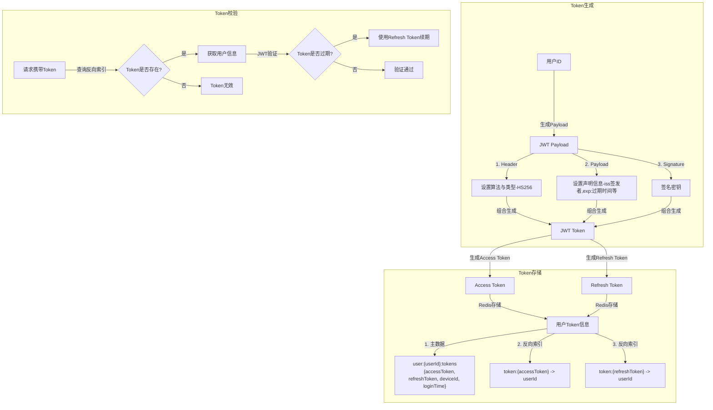

```mermaid
flowchart TD
    subgraph Token生成
        A[用户ID] -->|生成Payload| B[JWT Payload]
        B -->|1. Header| C[设置算法与类型-HS256]
        B -->|2. Payload| D[设置声明信息-iss签发者,exp:过期时间等]
        B -->|3. Signature| E[签名密钥]
        C & D & E -->|组合生成| F[JWT Token]
    end
    
    subgraph Token存储
        F -->|生成Access Token| G[Access Token]
        F -->|生成Refresh Token| H[Refresh Token]
        G & H -->|Redis存储| I[用户Token信息]
        I -->|1. 主数据| J["user:{userId}:tokens
        {accessToken, refreshToken, deviceId, loginTime}"]
        I -->|2. 反向索引| K["token:{accessToken} -> userId"]
        I -->|3. 反向索引| L["token:{refreshToken} -> userId"]
    end
    
    subgraph Token校验
        M[请求携带Token] -->|查询反向索引| N{Token是否存在?}
        N -->|是| O[获取用户信息]
        N -->|否| P[Token无效]
        O -->|JWT验证| Q{Token是否过期?}
        Q -->|是| R[使用Refresh Token续期]
        Q -->|否| S[验证通过]
    end
```