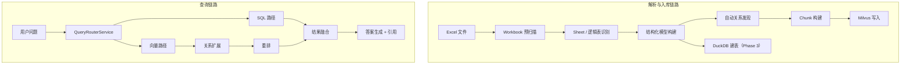

```mermaid
flowchart TD
    subgraph Ingest["解析与入库链路"]
        A1["Excel 文件"] --> A2["Workbook 预扫描"]
        A2 --> A3["Sheet / 逻辑表识别"]
        A3 --> A4["结构化模型构建"]
        A4 --> A5["自动关系发现"]
        A5 --> A6["Chunk 构建"]
        A6 --> A7["Milvus 写入"]
        A4 --> A8["DuckDB 建表（Phase 3）"]
    end

    subgraph Query["查询链路"]
        B1["用户问题"] --> B2["QueryRouterService"]
        B2 --> B3["向量路径"]
        B2 --> B4["SQL 路径"]
        B3 --> B5["关系扩展"]
        B5 --> B6["重排"]
        B4 --> B7["结果融合"]
        B6 --> B7
        B7 --> B8["答案生成 + 引用"]
    end
```