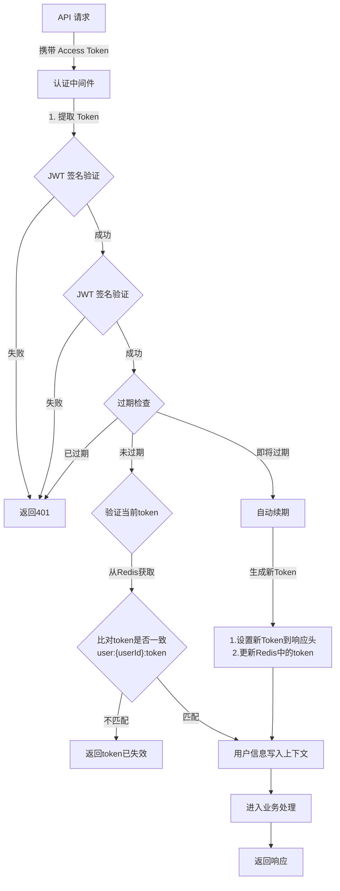

```mermaid
flowchart TD
    A[API 请求] -->|携带 Access Token| B[认证中间件]
    B -->|1. 提取 Token| C{JWT 签名验证}
    C -->|失败| D[返回401]
    C -->|成功| E{JWT 签名验证}
    E -->|失败| D
    E -->|成功| F{过期检查}
    
    F -->|已过期| D
    F -->|即将过期| G[自动续期]
    F -->|未过期| H{验证当前token}
    
    H -->|从Redis获取| I{"比对token是否一致
    user:{userId}:token"}
    I -->|不匹配| J[返回token已失效]
    I -->|匹配| K[用户信息写入上下文]
    K --> L[进入业务处理]
    L --> N[返回响应]
    
    G -->|生成新Token| M["1.设置新Token到响应头
    2.更新Redis中的token"]
    M --> K

    
```