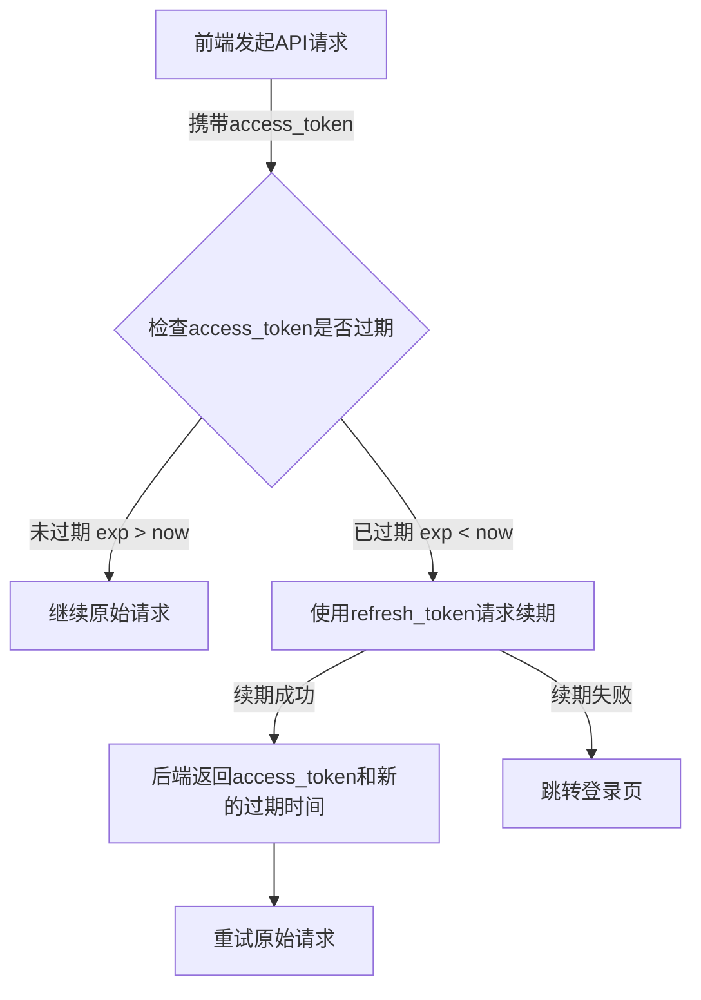

```mermaid
flowchart TD
    A[前端发起API请求] -->|携带access_token| B{检查access_token是否过期}
    B -->|未过期 exp > now| C[继续原始请求]
    B -->|已过期 exp < now| D[使用refresh_token请求续期]
    D -->|续期成功| E[后端返回access_token和新的过期时间]
    D -->|续期失败| F[跳转登录页]
    E --> G[重试原始请求]

```