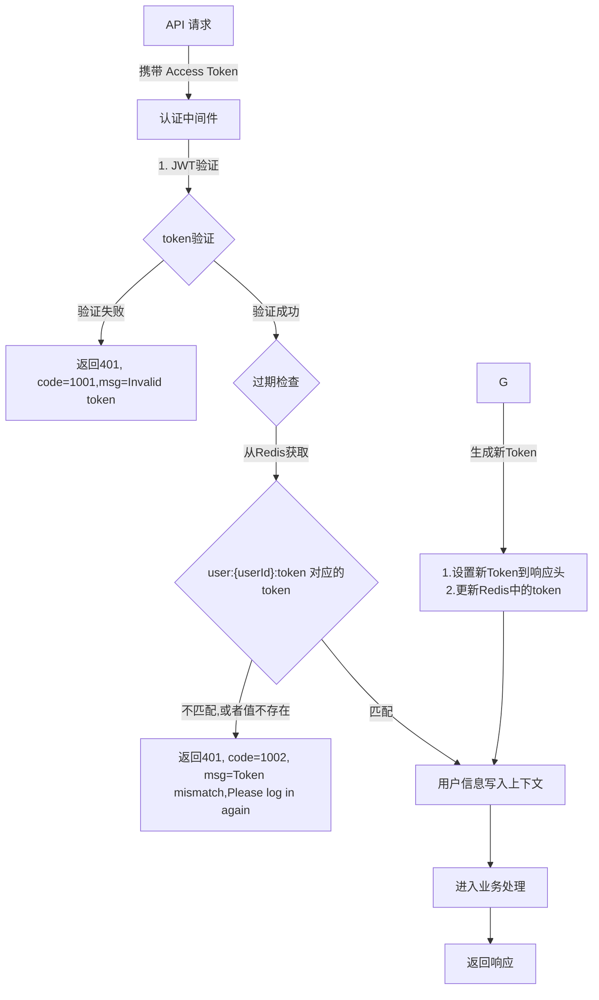

```mermaid

flowchart TD
    A[API 请求] -->|携带 Access Token| B[认证中间件]
    B -->|1. JWT验证| C{token验证}
    C -->|验证失败| D[返回401, code=1001,msg=Invalid token]
    C -->|验证成功| F{过期检查}
    
    F -->|从Redis获取| I{"user:{userId}:token" 对应的token}
    I -->|不匹配,或者值不存在| J[返回401, code=1002, msg=Token mismatch,Please log in again]
    I -->|匹配| K[用户信息写入上下文]
    K --> L[进入业务处理]
    L --> N[返回响应]
    
    G -->|生成新Token| M["1.设置新Token到响应头
    2.更新Redis中的token"]
    M --> K

```