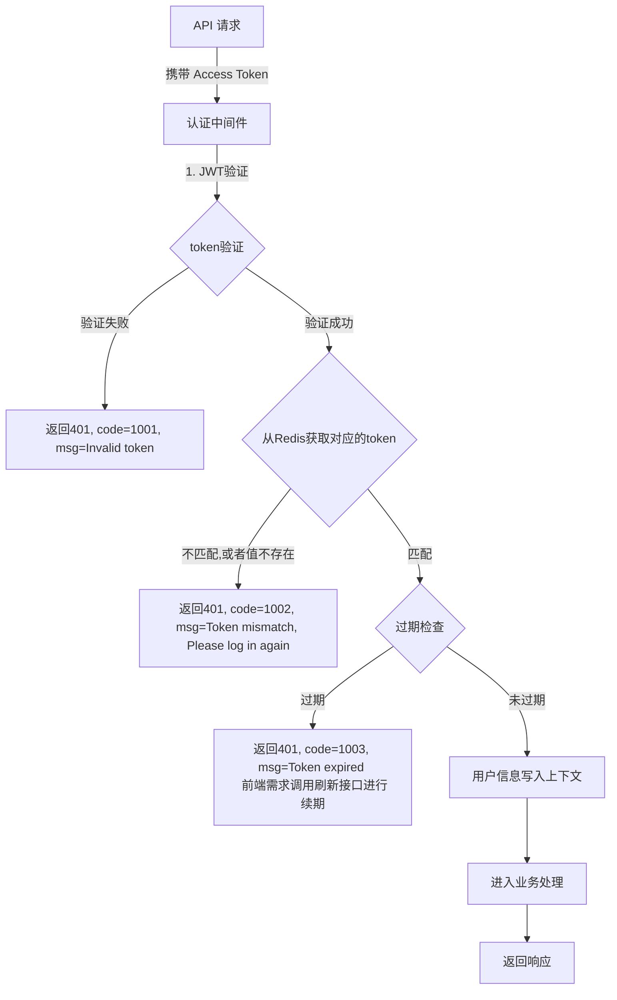

```mermaid

flowchart TD
    A[API 请求] -->|携带 Access Token| B[认证中间件]
    B -->|1. JWT验证| C{token验证}
    C -->|验证失败| D[返回401, code=1001, msg=Invalid token]
    C -->|验证成功| I{从Redis获取对应的token}
    
    I -->|不匹配,或者值不存在| J[返回401, code=1002, msg=Token mismatch, Please log in again]
    I -->|匹配| F{过期检查}
    
    F -->|过期| E[返回401, code=1003, msg=Token expired \n 前端需求调用刷新接口进行续期]
    F -->|未过期| K[用户信息写入上下文]
    K --> L[进入业务处理]
    L --> N[返回响应]

```