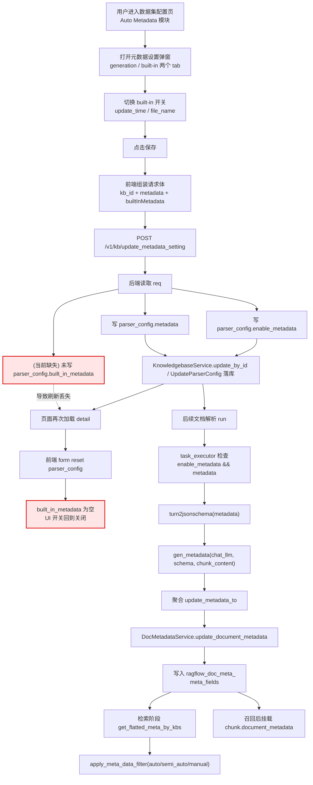

```mermaid
```mermaid
flowchart TD
    A["用户进入数据集配置页<br/>Auto Metadata 模块"] --> B["打开元数据设置弹窗<br/>generation / built-in 两个 tab"]
    B --> C["切换 built-in 开关<br/>update_time / file_name"]
    C --> D["点击保存"]

    D --> E["前端组装请求体<br/>kb_id + metadata + builtInMetadata"]
    E --> F["POST /v1/kb/update_metadata_setting"]

    F --> G["后端读取 req"]
    G --> H["写 parser_config.metadata"]
    G --> I["写 parser_config.enable_metadata"]
    G --> J["(当前缺失) 未写 parser_config.built_in_metadata"]

    H --> K["KnowledgebaseService.update_by_id / UpdateParserConfig 落库"]
    I --> K
    J -. "导致刷新丢失" .-> L["页面再次加载 detail"]
    K --> L

    L --> M["前端 form reset parser_config"]
    M --> N["built_in_metadata 为空<br/>UI 开关回到关闭"]

    K --> O["后续文档解析 run"]
    O --> P["task_executor 检查<br/>enable_metadata && metadata"]
    P --> Q["turn2jsonschema(metadata)"]
    Q --> R["gen_metadata(chat_llm, schema, chunk_content)"]
    R --> S["聚合 update_metadata_to"]
    S --> T["DocMetadataService.update_document_metadata"]

    T --> U["写入 ragflow_doc_meta_<tenant_id><br/>meta_fields"]
    U --> V["检索阶段 get_flatted_meta_by_kbs"]
    V --> W["apply_meta_data_filter(auto/semi_auto/manual)"]
    U --> X["召回后挂载 chunk.document_metadata"]

    style J fill:#ffe5e5,stroke:#d00,stroke-width:2px
    style N fill:#ffe5e5,stroke:#d00,stroke-width:2px

```
```