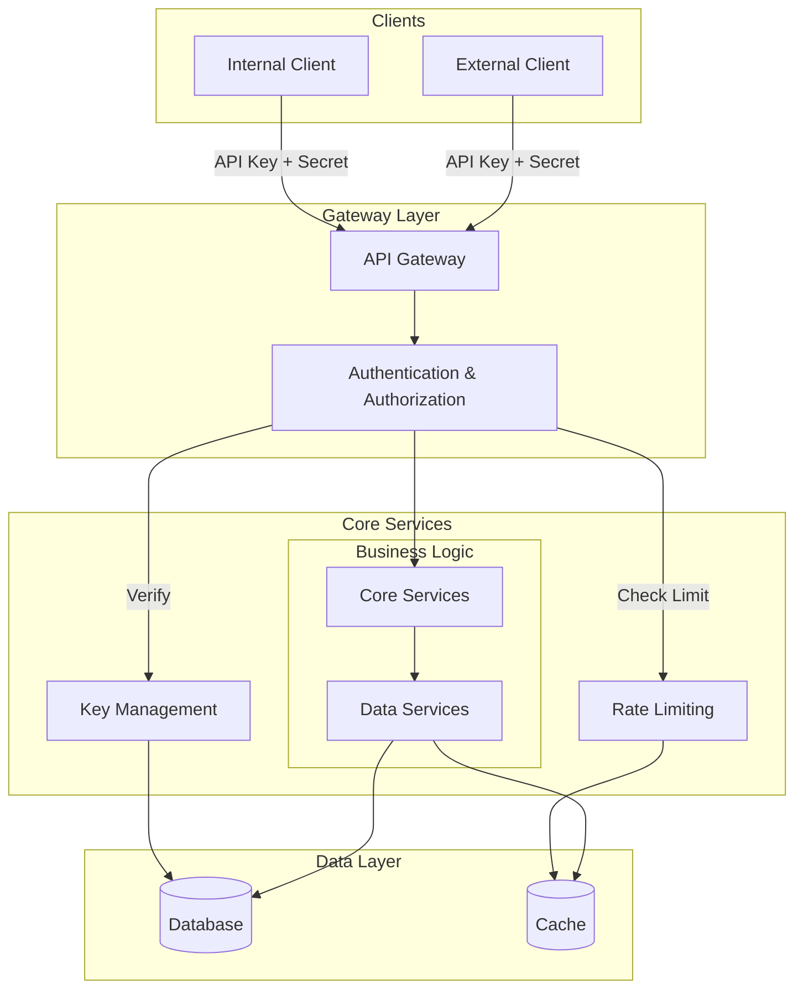

```mermaid
graph TB
    subgraph Clients
        IC[Internal Client]
        EC[External Client]
    end

    subgraph Gateway Layer
        API[API Gateway]
        Auth[Authentication & Authorization]
    end

    subgraph Core Services
        KM[Key Management]
        RM[Rate Limiting]
        subgraph Business Logic
            CS[Core Services]
            DS[Data Services]
        end
    end

    subgraph Data Layer
        DB[(Database)]
        Cache[(Cache)]
    end

    IC --> |API Key + Secret| API
    EC --> |API Key + Secret| API
    API --> Auth
    Auth --> |Verify| KM
    Auth --> |Check Limit| RM
    KM --> DB
    RM --> Cache
    Auth --> CS
    CS --> DS
    DS --> DB
    DS --> Cache
```