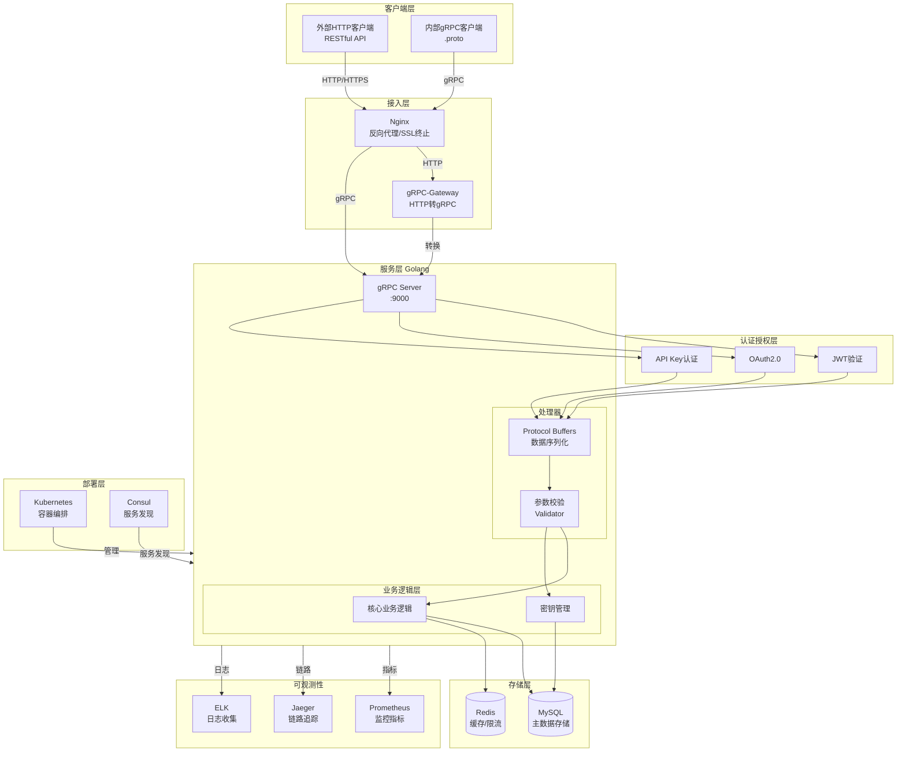

```mermaid
graph TD
    subgraph Clients["客户端层"]
        HTTP["外部HTTP客户端\nRESTful API"]
        GRPC["内部gRPC客户端\n.proto"]
    end

    subgraph Gateway["接入层"]
        Nginx["Nginx\n反向代理/SSL终止"]
        GW["gRPC-Gateway\n HTTP转gRPC"]
    end

    subgraph Auth["认证授权层"]
        JWT["JWT验证"]
        OAuth["OAuth2.0"]
        KeyAuth["API Key认证"]
    end

    subgraph Service["服务层 Golang"]
        GRPCS["gRPC Server\n:9000"]
        subgraph Handler["处理器"]
            Proto["Protocol Buffers\n数据序列化"]
            Valid["参数校验\nValidator"]
        end
        subgraph BizLogic["业务逻辑层"]
            Core["核心业务逻辑"]
            KeyMgmt["密钥管理"]
        end
    end

    subgraph Storage["存储层"]
        MySQL[("MySQL\n主数据存储")]
        Redis[("Redis\n缓存/限流")]
    end

    subgraph Observability["可观测性"]
        Prom["Prometheus\n监控指标"]
        Trace["Jaeger\n链路追踪"]
        Log["ELK\n日志收集"]
    end

    subgraph Deploy["部署层"]
        K8s["Kubernetes\n容器编排"]
        Consul["Consul\n服务发现"]
    end

    %% 客户端连接
    HTTP -->|HTTP/HTTPS| Nginx
    GRPC -->|gRPC| Nginx
    
    %% 网关层流转
    Nginx -->|HTTP| GW
    Nginx -->|gRPC| GRPCS
    GW -->|转换| GRPCS

    %% 认证流程
    GRPCS --> JWT
    GRPCS --> OAuth
    GRPCS --> KeyAuth
    
    %% 服务层处理
    JWT --> Proto
    OAuth --> Proto
    KeyAuth --> Proto
    Proto --> Valid
    Valid --> Core
    Valid --> KeyMgmt
    
    %% 存储交互
    Core --> MySQL
    Core --> Redis
    KeyMgmt --> MySQL
    
    %% 可观测性
    Service -->|指标| Prom
    Service -->|链路| Trace
    Service -->|日志| Log
    
    %% 部署管理
    K8s -->|管理| Service
    Consul -->|服务发现| Service

    
```