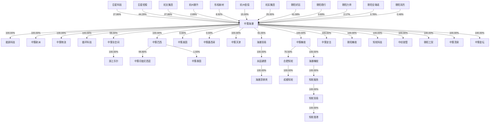

```mermaid
graph TD
    A[巨星科技] -->|27.86%| B[中策海潮]
    C[巨星控股] -->|44.29%| B
    D[杭叉集团] -->|27.86%| B
    E[杭州潮升] -->|2.89%| B
    F[彤程新材] -->|8.92%| B
    G[杭州金投] -->|15.00%| B
    H[杭实集团] -->|25.00%| B
    I[朝阳好运] -->|41.08%| B
    J[朝阳稳行] -->|3.69%| B
    K[朝阳力奔] -->|2.17%| B
    L[朝阳全瑞诺] -->|0.78%| B
    M[朝阳润杰] -->|0.46%| B
    
    B -->|100.00%| N[能源科技]
    B -->|100.00%| O[中策欧洲]
    B -->|100.00%| P[中策物流]
    B -->|100.00%| Q[循环科技]
    B -->|98.00%| R[中策车空间]
    R -->|100.00%| S[浙江乐尔]
    
    B -->|100.00%| T[中策巴西]
    T -->|99.80%| U[中策印度尼西亚]
    T -->|1.00%| V[中策泰国]
    
    B -->|0.00%| W[中策美国]
    B -->|0.00%| X[中策墨西哥]
    B -->|100.00%| Y[中策天津]
    
    B -->|81.05%| Z[海潮贸易]
    Z -->|100.00%| AA[永固建德]
    AA -->|100.00%| AB[海潮菲律宾]
    
    B -->|100.00%| AC[中策橡胶]
    AC -->|70.50%| AD[合肥知轮]
    AD -->|100.00%| AE[成都知轮]
    AC -->|100.00%| AF[海潮橡胶]
    AF -->|100.00%| AG[知轮服务]
    AG -->|100.00%| AH[知轮贸易]
    AH -->|100.00%| AI[知轮香港]
    
    B -->|100.00%| AJ[中策安吉]
    B -->|100.00%| AK[朝阳橡胶]
    B -->|100.00%| AL[知轮科技]
    B -->|100.00%| AM[中纺胶管]
    B -->|100.00%| AN[朝阳工贸]
    B -->|100.00%| AO[中策清泉]
    B -->|100.00%| AP[中策金坛]

```