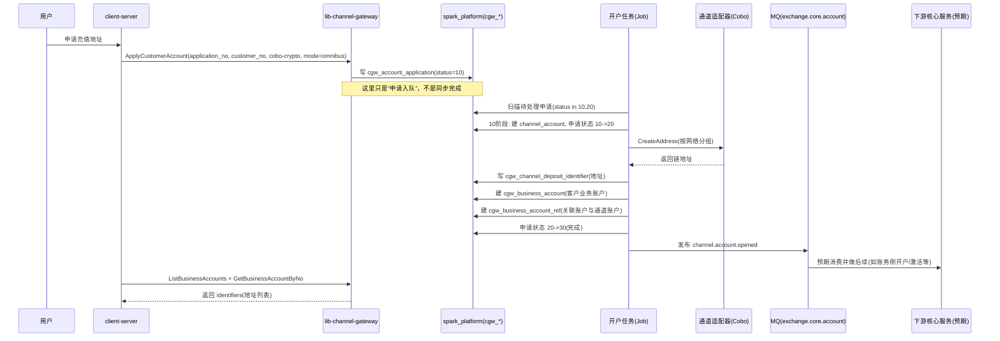

```mermaid
sequenceDiagram
    participant U as 用户
    participant C as client-server
    participant G as lib-channel-gateway
    participant DB as spark_platform(cgw_*)
    participant J as 开户任务(Job)
    participant ADP as 通道适配器(Cobo)
    participant MQ as MQ(exchange.core.account)
    participant Core as 下游核心服务(预期)

    U->>C: 申请充值地址
    C->>G: ApplyCustomerAccount(application_no, customer_no, cobo-crypto, mode=omnibus)
    G->>DB: 写 cgw_account_application(status=10)
    Note over G,DB: 这里只是“申请入队”，不是同步完成

    J->>DB: 扫描待处理申请(status in 10,20)
    J->>DB: 10阶段: 建 channel_account, 申请状态 10->20
    J->>ADP: CreateAddress(按网络分组)
    ADP-->>J: 返回链地址
    J->>DB: 写 cgw_channel_deposit_identifier(地址)
    J->>DB: 建 cgw_business_account(客户业务账户)
    J->>DB: 建 cgw_business_account_ref(关联账户与通道账户)
    J->>DB: 申请状态 20->30(完成)

    J->>MQ: 发布 channel.account.opened
    MQ->>Core: 预期消费并做后续(如账务侧开户/激活等)
    C->>G: ListBusinessAccounts + GetBusinessAccountByNo
    G-->>C: 返回 identifiers(地址列表)

```