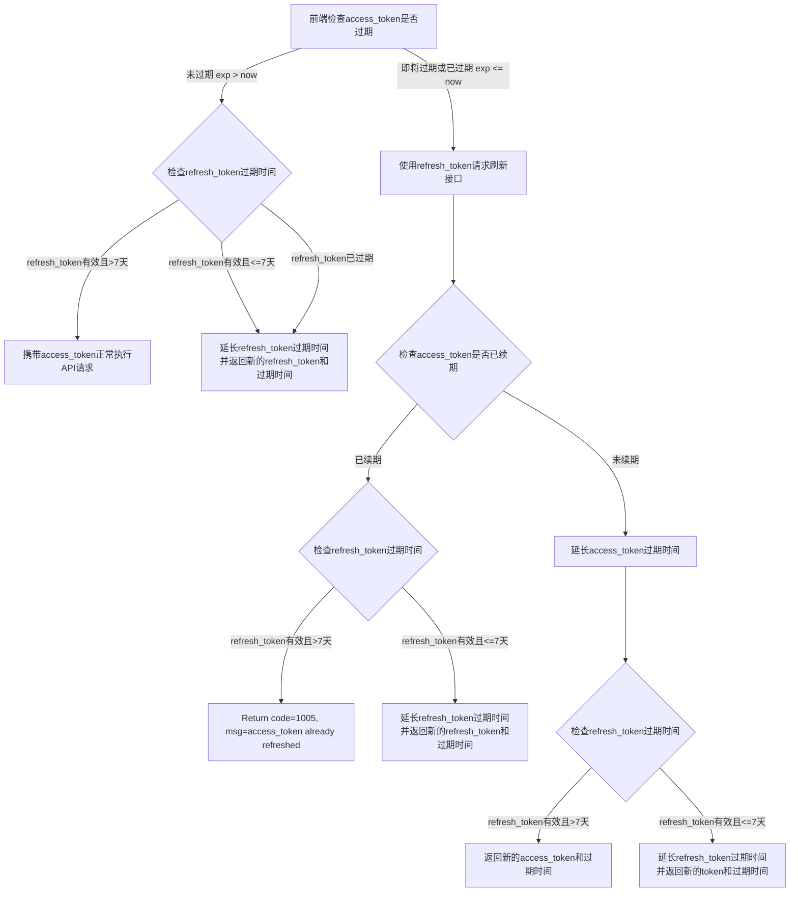

```mermaid
flowchart TD
    A[前端检查access_token是否过期] 
    A -->|未过期 exp > now| B{检查refresh_token过期时间}
    B -->|refresh_token有效且>7天| C[携带access_token正常执行API请求]
    B -->|refresh_token有效且<=7天| D[延长refresh_token过期时间并返回新的refresh_token和过期时间]
    B -->|refresh_token已过期| D[延长refresh_token过期时间并返回新的refresh_token和过期时间]
    A -->|即将过期或已过期 exp <= now| E[使用refresh_token请求刷新接口]
    E --> F{检查access_token是否已续期}
    F -->|已续期| G{检查refresh_token过期时间}
    F -->|未续期| H[延长access_token过期时间]
    G -->|refresh_token有效且>7天| I[Return code=1005, msg=access_token already refreshed]
    G -->|refresh_token有效且<=7天| J[延长refresh_token过期时间并返回新的refresh_token和过期时间]
    H --> K{检查refresh_token过期时间}
    K -->|refresh_token有效且>7天| L[返回新的access_token和过期时间]
    K -->|refresh_token有效且<=7天| M[延长refresh_token过期时间并返回新的token和过期时间]

```