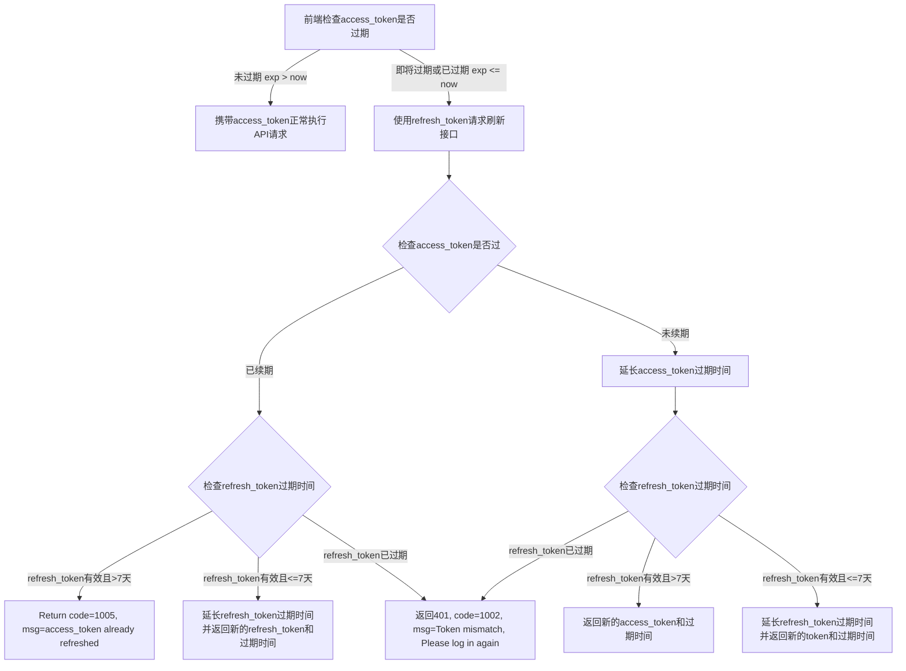

```mermaid
flowchart TD
    A[前端检查access_token是否过期] 
    A -->|未过期 exp > now| B[携带access_token正常执行API请求]
    A -->|即将过期或已过期 exp <= now| C[使用refresh_token请求刷新接口]
    C --> D{检查access_token是否过}
    D -->|已续期| E{检查refresh_token过期时间}
    D -->|未续期| F[延长access_token过期时间]
    E -->|refresh_token有效且>7天| G[Return code=1005, msg=access_token already refreshed]
    E -->|refresh_token有效且<=7天| H[延长refresh_token过期时间并返回新的refresh_token和过期时间]
    E -->|refresh_token已过期| I[返回401, code=1002, msg=Token mismatch, Please log in again]
    F --> J{检查refresh_token过期时间}
    J -->|refresh_token有效且>7天| K[返回新的access_token和过期时间]
    J -->|refresh_token有效且<=7天| L[延长refresh_token过期时间并返回新的token和过期时间]
    J -->|refresh_token已过期| I

```