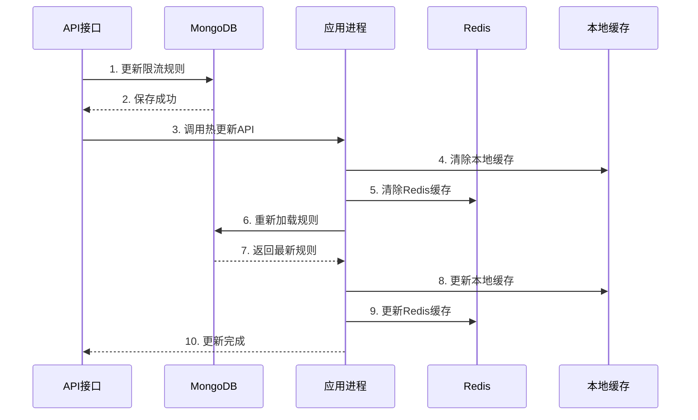

```mermaid

sequenceDiagram
    participant API as API接口
    participant API as API接口
    participant Mongo as MongoDB
    participant App as 应用进程
    participant Redis as Redis
    participant Cache as 本地缓存
    
    API->>Mongo: 1. 更新限流规则
    Mongo-->>API: 2. 保存成功
    
    API->>App: 3. 调用热更新API
    App->>Cache: 4. 清除本地缓存
    App->>Redis: 5. 清除Redis缓存
    App->>Mongo: 6. 重新加载规则
    Mongo-->>App: 7. 返回最新规则
    
    App->>Cache: 8. 更新本地缓存
    App->>Redis: 9. 更新Redis缓存
    App-->>API: 10. 更新完成

```