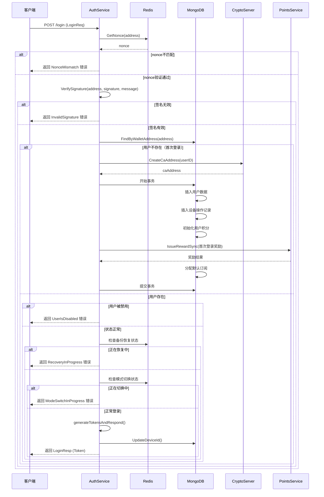

```mermaid
sequenceDiagram
    participant Client as 客户端
    participant AuthService as AuthService
    participant Redis as Redis
    participant MongoDB as MongoDB
    participant CryptoServer as CryptoServer
    participant PointsService as PointsService

    Client->>AuthService: POST /login (LoginReq)
    AuthService->>Redis: GetNonce(address)
    Redis-->>AuthService: nonce
    alt nonce不匹配
        AuthService-->>Client: 返回 NonceMismatch 错误
    else nonce验证通过
        AuthService->>AuthService: VerifySignature(address, signature, message)
        alt 签名无效
            AuthService-->>Client: 返回 InvalidSignature 错误
        else 签名有效
            AuthService->>MongoDB: FindByWalletAddress(address)
            alt 用户不存在（首次登录）
                AuthService->>CryptoServer: CreateCaAddress(userID)
                CryptoServer-->>AuthService: caAddress
                AuthService->>MongoDB: 开始事务
                MongoDB->>MongoDB: 插入用户数据
                MongoDB->>MongoDB: 插入设备操作记录
                MongoDB->>MongoDB: 初始化用户积分
                AuthService->>PointsService: IssueRewardSync(首次登录奖励)
                PointsService-->>AuthService: 奖励结果
                MongoDB->>MongoDB: 分配默认订阅
                AuthService->>MongoDB: 提交事务
            else 用户存在
                alt 用户被禁用
                    AuthService-->>Client: 返回 UserIsDisabled 错误
                else 状态正常
                    AuthService->>Redis: 检查备份恢复状态
                    alt 正在恢复中
                        AuthService-->>Client: 返回 RecoveryInProgress 错误
                    else 
                        AuthService->>Redis: 检查模式切换状态
                        alt 正在切换中
                            AuthService-->>Client: 返回 ModeSwitchInProgress 错误
                        else 正常登录
                            AuthService->>AuthService: generateTokensAndRespond()
                            AuthService->>MongoDB: UpdateDeviceId()

                            AuthService-->>Client: 返回 LoginResp (Token)
                        end
                    end
                end
            end
        end
    end
```