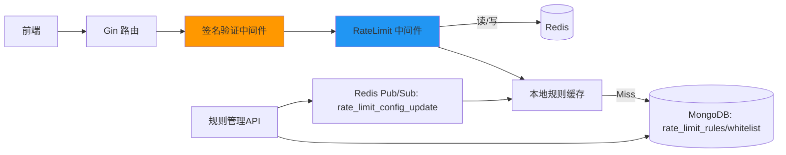

```mermaid
flowchart LR
    FE[前端] --> GIN[Gin 路由]
    GIN --> AUTH[签名验证中间件]
    AUTH --> RL[RateLimit 中间件]
    RL -->|读/写| R[(Redis)]
    RL --> Cache[本地规则缓存]
    Cache -->|Miss| MDB[(MongoDB: rate_limit_rules/whitelist)]
    Admin[规则管理API] --> MDB
    Admin --> Pub[Redis Pub/Sub: rate_limit_config_update]
    Pub --> Cache
    
    style AUTH fill:#ff9800
    style RL fill:#2196f3
```