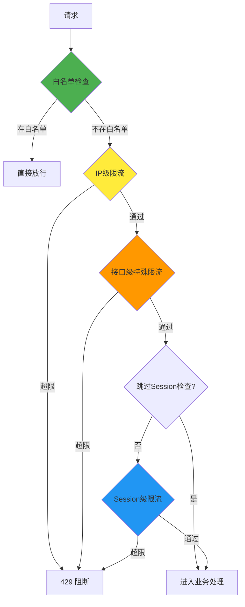

```mermaid
flowchart TD
    A[请求] --> B{白名单检查}
    B -- 在白名单 --> Z[直接放行]
    B -- 不在白名单 --> C{IP级限流}
    C -- 超限 --> X[429 阻断]
    C -- 通过 --> D{接口级特殊限流}
    D -- 超限 --> X
    D -- 通过 --> E{跳过Session检查?}
    E -- 是 --> F[进入业务处理]
    E -- 否 --> G{Session级限流}
    G -- 超限 --> X
    G -- 通过 --> F
    
    style B fill:#4caf50
    style C fill:#ffeb3b
    style D fill:#ff9800
    style G fill:#2196f3
```