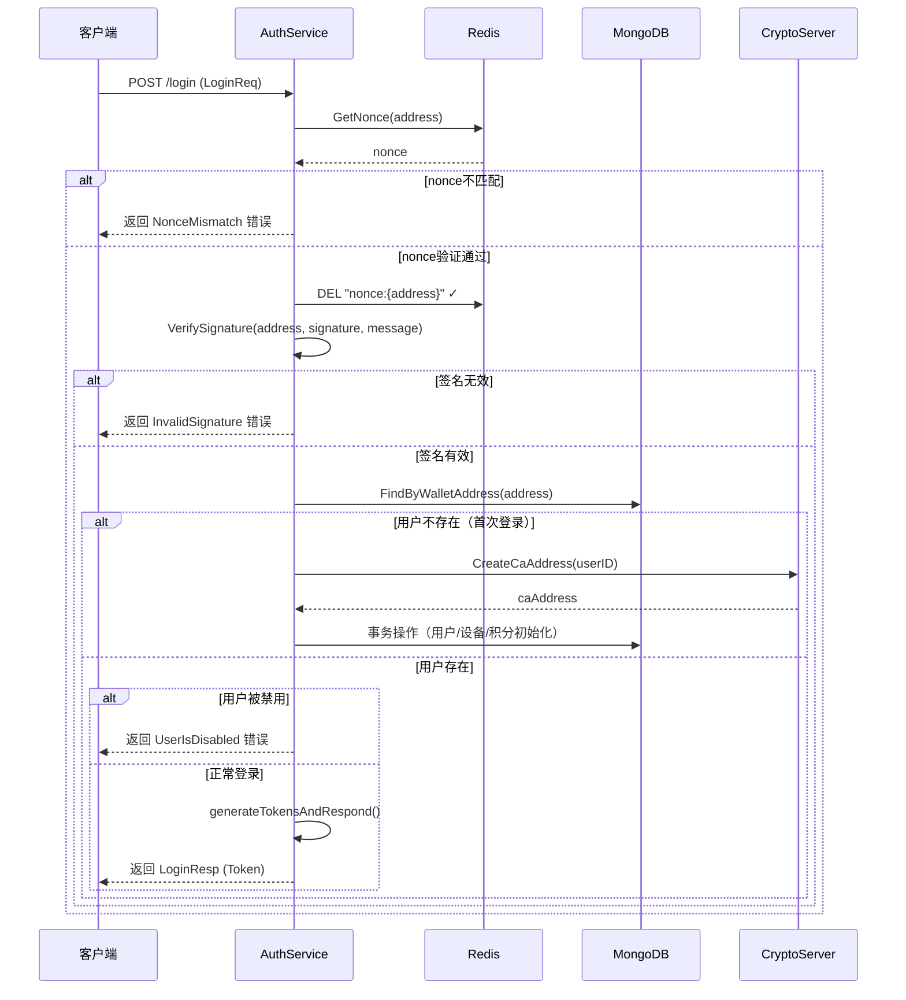

```mermaid
sequenceDiagram
    participant Client as 客户端
    participant AuthService as AuthService
    participant Redis as Redis
    participant MongoDB as MongoDB
    participant CryptoServer as CryptoServer

    Client->>AuthService: POST /login (LoginReq)
    AuthService->>Redis: GetNonce(address)
    Redis-->>AuthService: nonce
    alt nonce不匹配
        AuthService-->>Client: 返回 NonceMismatch 错误
    else nonce验证通过
        AuthService->>Redis: DEL "nonce:{address}" ✓
        AuthService->>AuthService: VerifySignature(address, signature, message)
        alt 签名无效
            AuthService-->>Client: 返回 InvalidSignature 错误
        else 签名有效
            AuthService->>MongoDB: FindByWalletAddress(address)
            alt 用户不存在（首次登录）
                AuthService->>CryptoServer: CreateCaAddress(userID)
                CryptoServer-->>AuthService: caAddress
                AuthService->>MongoDB: 事务操作（用户/设备/积分初始化）
            else 用户存在
                alt 用户被禁用
                    AuthService-->>Client: 返回 UserIsDisabled 错误
                else 正常登录
                    AuthService->>AuthService: generateTokensAndRespond()
                    AuthService-->>Client: 返回 LoginResp (Token)
                end
            end
        end
    end
```