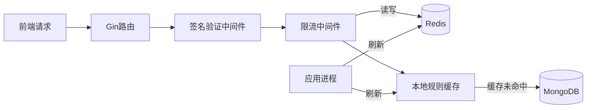

```mermaid
flowchart LR
    FE[前端请求] --> GIN[Gin路由]
    GIN --> AUTH[签名验证中间件]
    AUTH --> RL[限流中间件]
    RL -->|读写| REDIS[(Redis)]
    RL --> CACHE[本地规则缓存]
    CACHE -->|缓存未命中| MONGO[(MongoDB)]
    
    
    APP[应用进程] -->|刷新| REDIS
    APP -->|刷新| CACHE
    
   
```