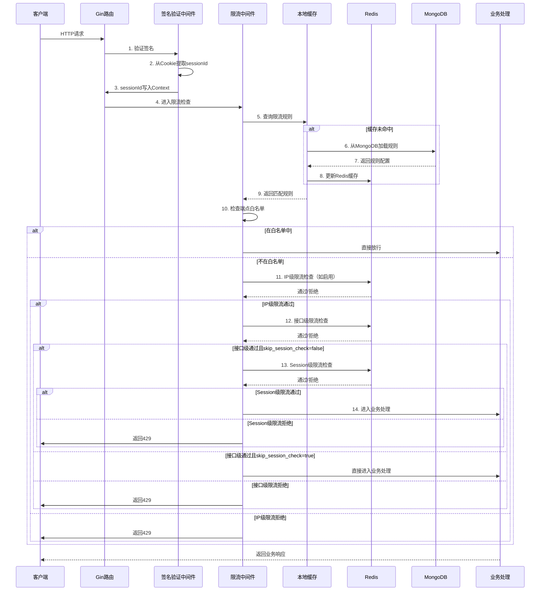

```mermaid
sequenceDiagram
    participant Client as 客户端
    participant Gin as Gin路由
    participant Auth as 签名验证中间件
    participant RL as 限流中间件
    participant Cache as 本地缓存
    participant Redis as Redis
    participant Mongo as MongoDB
    participant Business as 业务处理
    
    Client->>Gin: HTTP请求
    Gin->>Auth: 1. 验证签名
    Auth->>Auth: 2. 从Cookie提取sessionId
    Auth->>Gin: 3. sessionId写入Context
    
    Gin->>RL: 4. 进入限流检查
    RL->>Cache: 5. 查询限流规则
    alt 缓存未命中
        Cache->>Mongo: 6. 从MongoDB加载规则
        Mongo-->>Cache: 7. 返回规则配置
        Cache->>Redis: 8. 更新Redis缓存
    end
    Cache-->>RL: 9. 返回匹配规则
    
    RL->>RL: 10. 检查端点白名单
    alt 在白名单中
        RL->>Business: 直接放行
    else 不在白名单
        RL->>Redis: 11. IP级限流检查（如启用）
        Redis-->>RL: 通过/拒绝
        
        alt IP级限流通过
            RL->>Redis: 12. 接口级限流检查
            Redis-->>RL: 通过/拒绝
            
            alt 接口级通过且skip_session_check=false
                RL->>Redis: 13. Session级限流检查
                Redis-->>RL: 通过/拒绝
                
                alt Session级限流通过
                    RL->>Business: 14. 进入业务处理
                else Session级限流拒绝
                    RL->>Client: 返回429
                end
            else 接口级通过且skip_session_check=true
                RL->>Business: 直接进入业务处理
            else 接口级限流拒绝
                RL->>Client: 返回429
            end
        else IP级限流拒绝
            RL->>Client: 返回429
        end
    end
    
    Business-->>Client: 返回业务响应
```