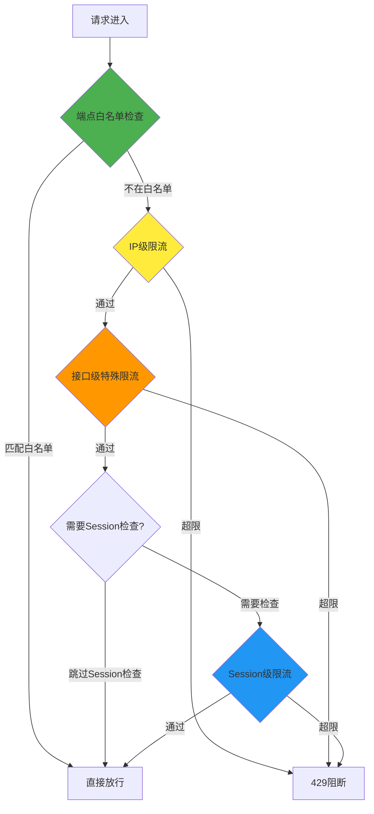

```mermaid
flowchart TD
    A[请求进入] --> B{端点白名单检查}
    B -- 匹配白名单 --> PASS[直接放行]
    B -- 不在白名单 --> C{IP级限流}
    C -- 超限 --> BLOCK[429阻断]
    C -- 通过 --> D{接口级特殊限流}
    D -- 超限 --> BLOCK
    D -- 通过 --> E{需要Session检查?}
    E -- 跳过Session检查 --> PASS
    E -- 需要检查 --> F{Session级限流}
    F -- 超限 --> BLOCK
    F -- 通过 --> PASS
    
    style B fill:#4caf50
    style C fill:#ffeb3b
    style D fill:#ff9800
    style F fill:#2196f3
```