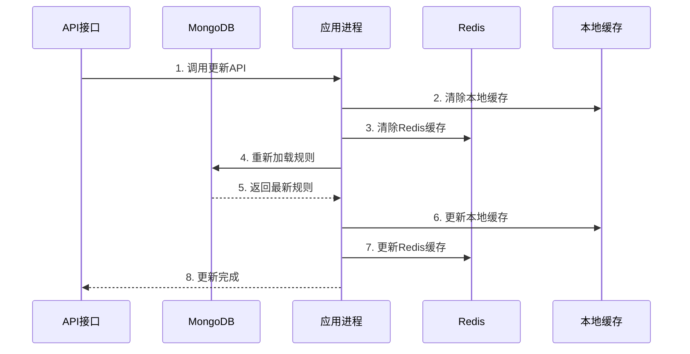

```mermaid

sequenceDiagram
   
    participant API as API接口
    participant Mongo as MongoDB
    participant App as 应用进程
    participant Redis as Redis
    participant Cache as 本地缓存
    
    
    API->>App: 1. 调用更新API
    App->>Cache: 2. 清除本地缓存
    App->>Redis: 3. 清除Redis缓存
    App->>Mongo: 4. 重新加载规则
    Mongo-->>App: 5. 返回最新规则
    
    App->>Cache: 6. 更新本地缓存
    App->>Redis: 7. 更新Redis缓存
    App-->>API: 8. 更新完成

```