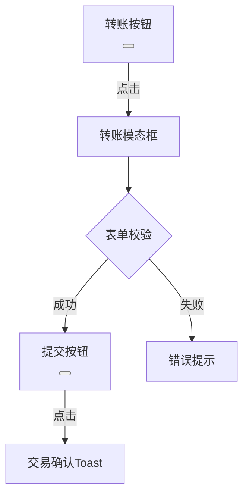

```mermaid
graph TD
  A[转账按钮<br/><Button variant="primary">] -->|点击| B[转账模态框<br/><Dialog>]
  B --> C{表单校验}
  C -->|成功| D[提交按钮<br/><Button variant="default">]
  C -->|失败| E[错误提示<br/><Alert>]
  D -->|点击| F[交易确认Toast<br/><Toast>]
```