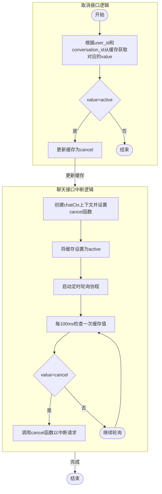

```mermaid
flowchart TD
    subgraph CancelInterface[取消接口逻辑]
        direction TB
        Start([开始]) --> A[根据user_id和conversation_id从缓存获取对应的value]
        A --> B{value=active}
        B --> |是| C[更新缓存为cancel]
        B --> |否| End2([结束])
    end

    subgraph ChatInterface[聊天接口中断逻辑]
        direction TB
        D[创建chatCtx上下文并设置cancel函数] --> E[将缓存设置为active]
        E --> F[启动定时轮询协程]
        F --> G[每100ms检查一次缓存值]
        G --> H{value=cancel}
        H --> |是| I[调用cancel函数以中断请求]
        H --> |否| J([继续轮询])
        J --> G
    end

    C --> |更新缓存| ChatInterface
    ChatInterface --> |完成| End3([结束])

```