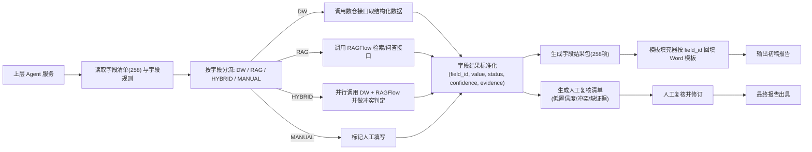

```mermaid
```mermaid
flowchart LR
    A["上层 Agent 服务"] --> B["读取字段清单(258) 与字段规则"]
    B --> C["按字段分流: DW / RAG / HYBRID / MANUAL"]

    C -->|DW| D["调用数仓接口取结构化数据"]
    C -->|RAG| E["调用 RAGFlow 检索/问答接口"]
    C -->|HYBRID| F["并行调用 DW + RAGFlow 并做冲突判定"]
    C -->|MANUAL| G["标记人工填写"]

    D --> H["字段结果标准化\n(field_id, value, status, confidence, evidence)"]
    E --> H
    F --> H
    G --> H

    H --> I["生成字段结果包(258项)"]
    I --> J["模板填充器按 field_id 回填 Word 模板"]
    J --> K["输出初稿报告"]

    H --> L["生成人工复核清单\n(低置信度/冲突/缺证据)"]
    L --> M["人工复核并修订"]
    M --> N["最终报告出具"]
```