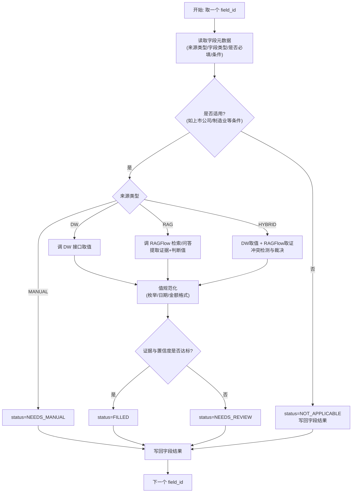

```mermaid
```mermaid
flowchart TD
    S["开始: 取一个 field_id"] --> T["读取字段元数据\n(来源类型/字段类型/是否必填/条件)"]
    T --> U{"是否适用?\n(如上市公司/制造业等条件)"}

    U -->|否| NA["status=NOT_APPLICABLE\n写回字段结果"]
    U -->|是| V{"来源类型"}

    V -->|DW| W["调 DW 接口取值"]
    V -->|RAG| X["调 RAGFlow 检索/问答\n提取证据+判断值"]
    V -->|HYBRID| Y["DW取值 + RAGFlow取证\n冲突检测与裁决"]
    V -->|MANUAL| Z["status=NEEDS_MANUAL"]

    W --> Q["值规范化\n(枚举/日期/金额格式)"]
    X --> Q
    Y --> Q
    Z --> R["写回字段结果"]

    Q --> C1{"证据与置信度是否达标?"}
    C1 -->|是| R1["status=FILLED"]
    C1 -->|否| R2["status=NEEDS_REVIEW"]

    R1 --> R["写回字段结果"]
    R2 --> R
    NA --> R
    R --> END["下一个 field_id"]

```
```