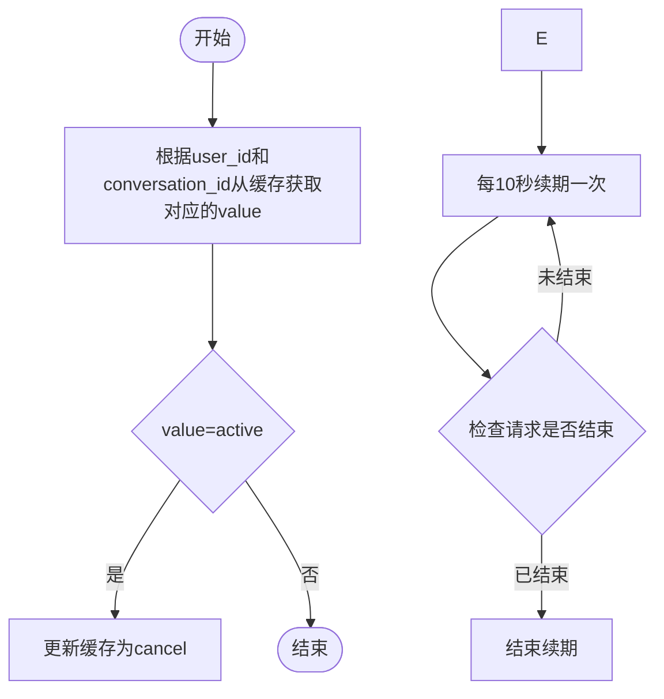

```mermaid
flowchart TD
    Start([开始]) --> A[根据user_id和conversation_id从缓存获取对应的value]
    A --> B{value=active}
    B --> |是| C[更新缓存为cancel]
    B --> |否| End2([结束])
    
    
    
    
    %% 锁续期协程
    E --> O[每10秒续期一次]
    O --> P{检查请求是否结束}
    P -->|未结束| O
    P -->|已结束| Q[结束续期]

```