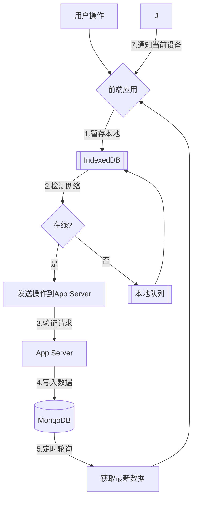

```mermaid
graph TD
    A[用户操作] --> B{前端应用}
    B -->|1.暂存本地| C[[IndexedDB]]
    C -->|2.检测网络| D{在线?}
    D -->|是| E[发送操作到App Server]
    D -->|否| F[[本地队列]] --> C
    E -->|3.验证请求| G[App Server]
    G -->|4.写入数据| H[(MongoDB)]
    H -->|5.定时轮询| I[获取最新数据]
    I -->B
    J -->|7.通知当前设备| B
```