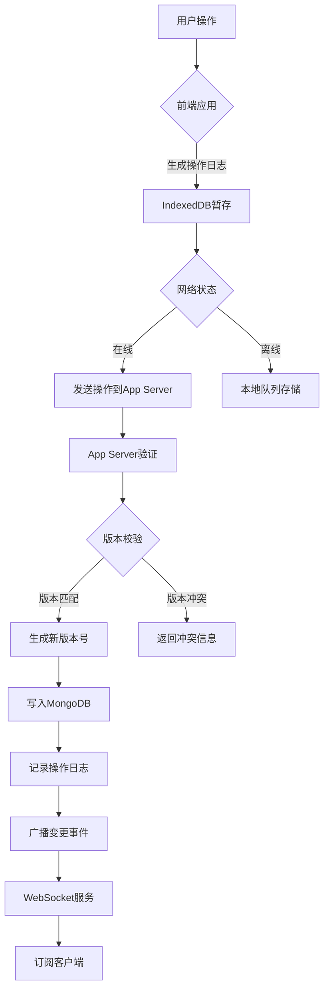

```mermaid
graph TD
    A[用户操作] --> B{前端应用}
    B -->|生成操作日志| C[IndexedDB暂存]
    C --> D{网络状态}
    D -->|在线| E[发送操作到App Server]
    D -->|离线| F[本地队列存储]
    E --> G[App Server验证]
    G --> H{版本校验}
    H -->|版本匹配| I[生成新版本号]
    H -->|版本冲突| J[返回冲突信息]
    I --> K[写入MongoDB]
    K --> L[记录操作日志]
    L --> M[广播变更事件]
    M --> N[WebSocket服务]
    N --> O[订阅客户端]
```