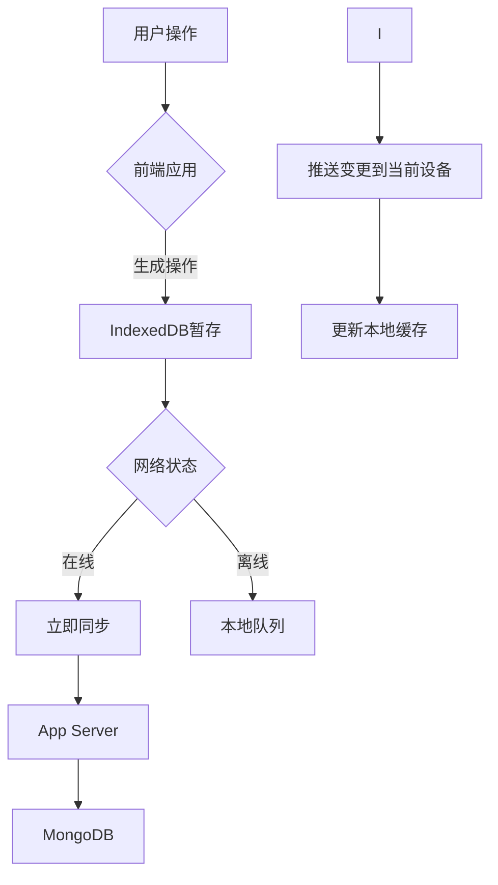

```mermaid
graph TD
    A[用户操作] --> B{前端应用}
    B -->|生成操作| C[IndexedDB暂存]
    C --> D{网络状态}
    D -->|在线| E[立即同步]
    D -->|离线| F[本地队列]
    E --> G[App Server]
    G --> H[MongoDB]
    I --> J[推送变更到当前设备]
    J --> K[更新本地缓存]
```