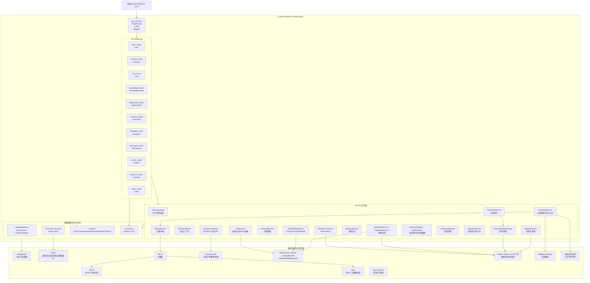

```mermaid
```mermaid
flowchart TB
    Client["前端 React/Vite 或 API Client"]

    subgraph Backend["FastAPI Backend: backend/app"]
        App["app_main.py<br/>FastAPI App<br/>CORS<br/>lifespan"]
        
        subgraph Routers["API Router 层"]
            AuthRouter["auth_router<br/>/auth"]
            SessionRouter["session_router<br/>/sessions"]
            ChatRouter["chat_router<br/>/chat"]
            KnowledgeRouter["knowledge_router<br/>/knowledge-bases"]
            AttachmentRouter["attachment_router<br/>/attachments"]
            MemoryRouter["memory_router<br/>/memories"]
            DatabaseRouter["database_router<br/>/database"]
            DocumentRouter["document_router<br/>/documents"]
            SearchRouter["search_router<br/>/search"]
            ResearchRouter["research_router<br/>/research"]
            NewsRouter["news_router<br/>/news"]
        end

        subgraph Services["Service 业务层"]
            AuthSecurity["core/security.py<br/>JWT/密码校验"]
            ChatService["ChatService<br/>聊天生成/RAG 编排"]
            SessionService["SessionService<br/>会话上下文"]
            DocumentService["DocumentService<br/>RAGFlow 文档 API"]
            WebSearchService["WebSearchService<br/>Web Search"]
            KnowledgeProcessing["DocMindService<br/>文档解析/切片/入库"]
            RetrievalService["RetrievalService<br/>向量检索"]
            EmbeddingService["EmbeddingService<br/>DashScope Embedding"]
            MilvusService["MilvusService<br/>向量存储"]
            MemoryService["MemoryService<br/>长期记忆"]
            ResearchService["ResearchService / DeepResearchV2<br/>深度研究"]
            ReActStack["ReActController + ToolExecutor<br/>工具调用/多步骤推理"]
            DatabaseExplorer["DatabaseExplorer<br/>库表探索"]
            Text2SQLService["Text2SQLService<br/>自然语言转 SQL"]
            NewsCollection["NewsCollectionService<br/>资讯采集"]
            BiddingService["BiddingService<br/>招投标采集"]
            SchedulerService["SchedulerService<br/>定时任务"]
        end

        subgraph Persistence["数据模型/持久化访问"]
            DBCore["core/database.py<br/>SQLAlchemy Engine/Session"]
            RedisCore["core/redis_client.py<br/>RedisCache"]
            Models["models/*<br/>User/Chat/Knowledge/Research/News/Industry"]
            Schemas["schemas/*<br/>Pydantic DTO"]
        end
    end

    subgraph Infra["基础设施与外部系统"]
        PostgreSQL["PostgreSQL<br/>业务关系数据"]
        Redis["Redis<br/>缓存/会话/取消标记/搜索缓存"]
        Milvus["Milvus<br/>向量库"]
        MinIO["MinIO<br/>Milvus 对象存储"]
        Etcd["Etcd<br/>Milvus 元数据协调"]
        Elasticsearch["Elasticsearch<br/>可选全文检索"]
        RAGFlow["RAGFlow API<br/>文档上传/解析/检索"]
        DashScope["DashScope / OpenAI Compatible API<br/>LLM/Embedding/Rerank"]
        SerperBocha["Serper / Bocha / 81API 等<br/>搜索/资讯/招投标"]
        DocMind["Alibaba DocMind<br/>文档解析"]
        LocalFS["本地文件系统<br/>上传文件/附件"]
    end

    Client --> App
    App --> Routers
    Routers --> Services
    Routers --> Schemas
    Services --> Persistence
    Persistence --> PostgreSQL
    RedisCore --> Redis
    MilvusService --> Milvus
    Milvus --> MinIO
    Milvus --> Etcd

    DocumentService --> RAGFlow
    ChatService --> DashScope
    EmbeddingService --> DashScope
    WebSearchService --> SerperBocha
    ResearchService --> DashScope
    ResearchService --> SerperBocha
    KnowledgeProcessing --> DocMind
    KnowledgeProcessing --> MilvusService
    KnowledgeProcessing --> LocalFS
    NewsCollection --> SerperBocha
    BiddingService --> SerperBocha
    SchedulerService --> NewsCollection

```
```