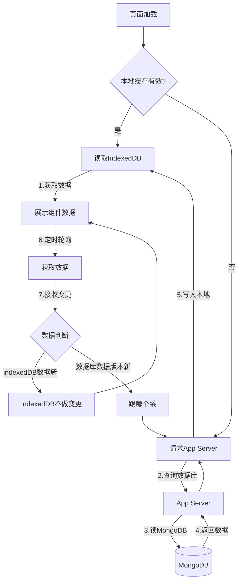

```mermaid

graph TD
    A[页面加载] --> B{本地缓存有效?}
    B -->|是| C[读取IndexedDB]
    B -->|否| D[请求App Server]
    C -->|1.获取数据| E[展示组件数据]
    D -->|2.查询数据库| F[App Server]
    F -->|3.读MongoDB| G[(MongoDB)]
    G -->|4.返回数据| F --> D
    D -->|5.写入本地| C
    E -->|6.定时轮询| H[获取数据]
    H -->|7.接收变更| I{数据判断}
    I -->|indexedDB数据新| J[indexedDB不做变更]
    I -->|数据库数据版本新| K[跟哪个系]
    J --> E
    K --> D

```