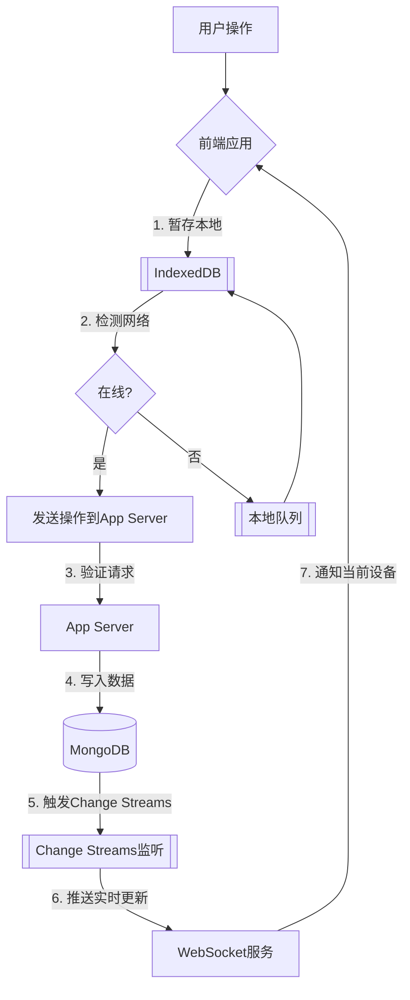

```mermaid
graph TD
    A[用户操作] --> B{前端应用}
    B -->|1. 暂存本地| C[[IndexedDB]]
    C -->|2. 检测网络| D{在线?}
    D -->|是| E[发送操作到App Server]
    D -->|否| F[[本地队列]] --> C
    E -->|3. 验证请求| G[App Server]
    G -->|4. 写入数据| H[(MongoDB)]
    H -->|5. 触发Change Streams| I[[Change Streams监听]]
    I -->|6. 推送实时更新| J[WebSocket服务]
    J -->|7. 通知当前设备| B
```