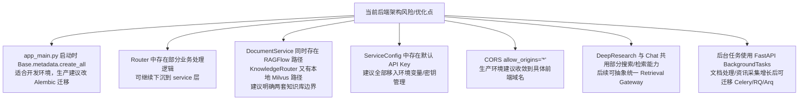

```mermaid
```mermaid
flowchart TD
    A["当前后端架构风险/优化点"] --> B["app_main.py 启动时 Base.metadata.create_all<br/>适合开发环境，生产建议改 Alembic 迁移"]
    A --> C["Router 中存在部分业务处理逻辑<br/>可继续下沉到 service 层"]
    A --> D["DocumentService 同时存在 RAGFlow 路径<br/>KnowledgeRouter 又有本地 Milvus 路径<br/>建议明确两套知识库边界"]
    A --> E["ServiceConfig 中存在默认 API Key<br/>建议全部移入环境变量/密钥管理"]
    A --> F["CORS allow_origins='*'<br/>生产环境建议收敛到具体前端域名"]
    A --> G["DeepResearch 与 Chat 共用部分搜索/检索能力<br/>后续可抽象统一 Retrieval Gateway"]
    A --> H["后台任务使用 FastAPI BackgroundTasks<br/>文档处理/资讯采集增长后可迁移 Celery/RQ/Arq"]

```
```