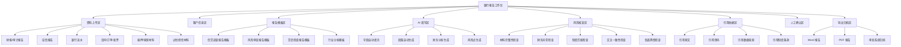

```mermaid
```mermaid
flowchart TD
    A["银行报告工作台"] --> B["资料上传区"]
    A --> C["客户信息区"]
    A --> D["报告模板区"]
    A --> E["AI 填写区"]
    A --> F["风险核查区"]
    A --> G["引用依据区"]
    A --> H["人工确认区"]
    A --> I["导出归档区"]

    B --> B1["财报/审计报告"]
    B --> B2["征信报告"]
    B --> B3["银行流水"]
    B --> B4["合同/订单/发票"]
    B --> B5["抵押/担保材料"]
    B --> B6["过往授信材料"]

    D --> D1["信贷调查报告模板"]
    D --> D2["风险审查报告模板"]
    D --> D3["贷后检查报告模板"]
    D --> D4["行业分析模板"]

    E --> E1["字段自动填充"]
    E --> E2["段落自动生成"]
    E --> E3["财务分析生成"]
    E --> E4["风险点生成"]

    F --> F1["材料完整性检查"]
    F --> F2["财务异常检查"]
    F --> F3["制度匹配检查"]
    F --> F4["交叉一致性检查"]
    F --> F5["负面舆情检查"]

    G --> G1["引用原文"]
    G --> G2["引用页码"]
    G --> G3["引用数据来源"]
    G --> G4["引用制度条款"]

    I --> I1["Word 报告"]
    I --> I2["PDF 报告"]
    I --> I3["审批系统归档"]

```