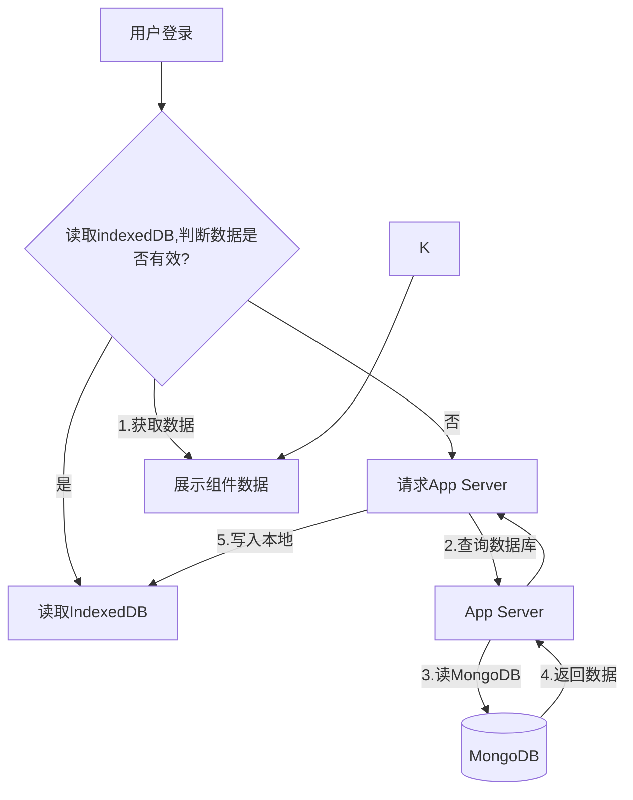

```mermaid
graph TD
    A[用户登录] --> B{读取indexedDB,判断数据是否有效?}
    B -->|是| C[读取IndexedDB]
    B -->|否| D[请求App Server]
    B -->|1.获取数据| E[展示组件数据]
    D -->|2.查询数据库| F[App Server]
    F -->|3.读MongoDB| G[(MongoDB)]
    G -->|4.返回数据| F --> D
    D -->|5.写入本地| C
    K --> E
```