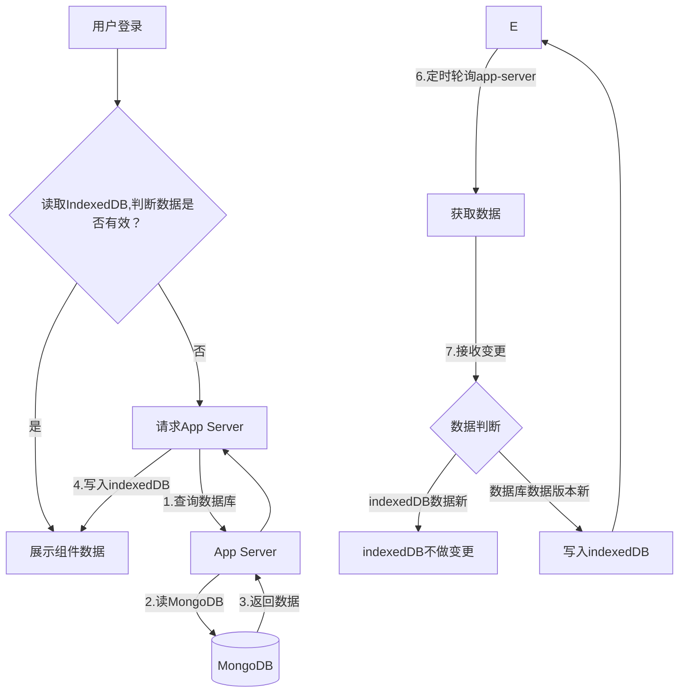

```mermaid
graph TD
    A[用户登录] --> B{读取IndexedDB,判断数据是否有效？}
    B -->|是| C[展示组件数据]
    B -->|否| D[请求App Server]
    
    D -->|1.查询数据库| F[App Server]
    F -->|2.读MongoDB| G[(MongoDB)]
    G -->|3.返回数据| F --> D
    D -->|4.写入indexedDB| C
    E -->|6.定时轮询app-server| H[获取数据]
    H -->|7.接收变更| I{数据判断}
    I -->|indexedDB数据新| J[indexedDB不做变更]
    I -->|数据库数据版本新| K[写入indexedDB]
    K --> E
```