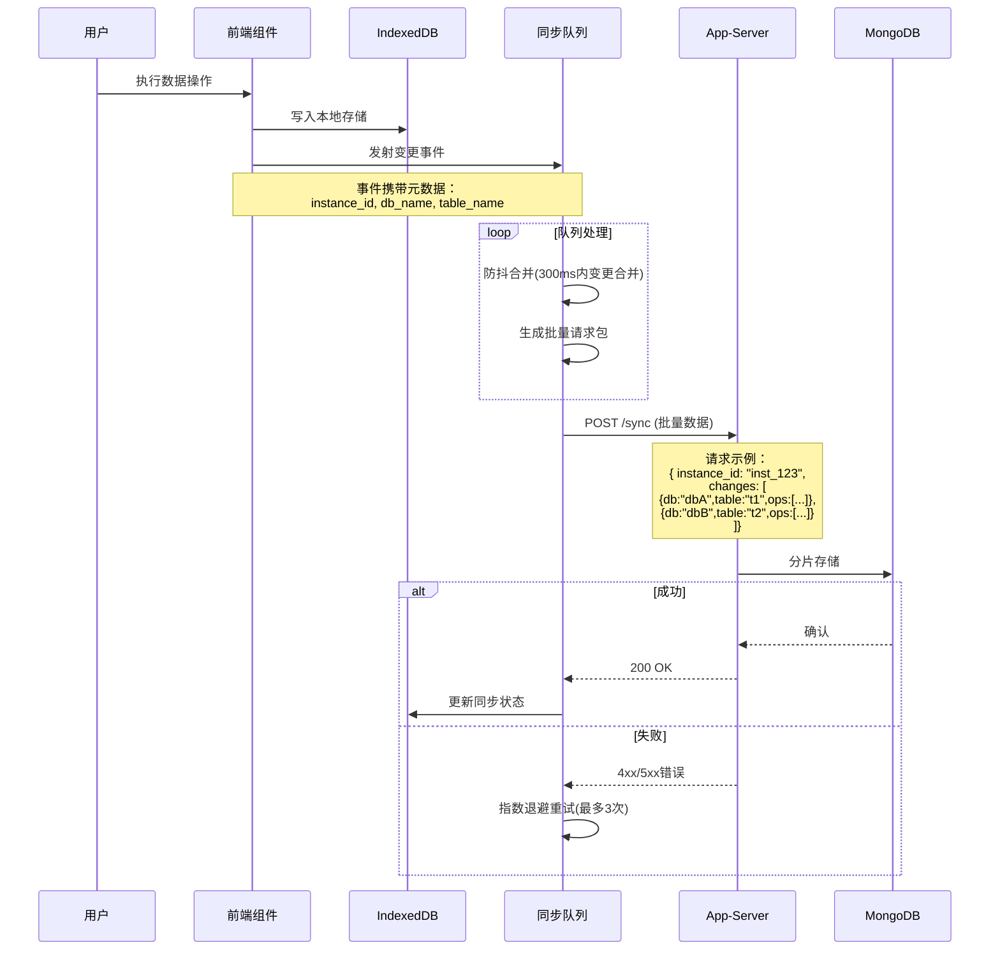

```mermaid
sequenceDiagram
    participant 用户 as 用户
    participant 组件 as 前端组件
    participant IndexedDB as IndexedDB
    participant 队列 as 同步队列
    participant 后端 as App-Server
    participant MongoDB as MongoDB

    用户->>组件: 执行数据操作
    组件->>IndexedDB: 写入本地存储
    组件->>队列: 发射变更事件
    Note over 组件,队列: 事件携带元数据：<br/>instance_id, db_name, table_name
    
    loop 队列处理
        队列->>队列: 防抖合并(300ms内变更合并)
        队列->>队列: 生成批量请求包
    end
    
    队列->>后端: POST /sync (批量数据)
    Note over 后端: 请求示例：<br/>{ instance_id: "inst_123",<br/> changes: [<br/>   {db:"dbA",table:"t1",ops:[...]},<br/>   {db:"dbB",table:"t2",ops:[...]}<br/> ]}
    
    后端->>MongoDB: 分片存储
    alt 成功
        MongoDB-->>后端: 确认
        后端-->>队列: 200 OK
        队列->>IndexedDB: 更新同步状态
    else 失败
        后端-->>队列: 4xx/5xx错误
        队列->>队列: 指数退避重试(最多3次)
    end
```