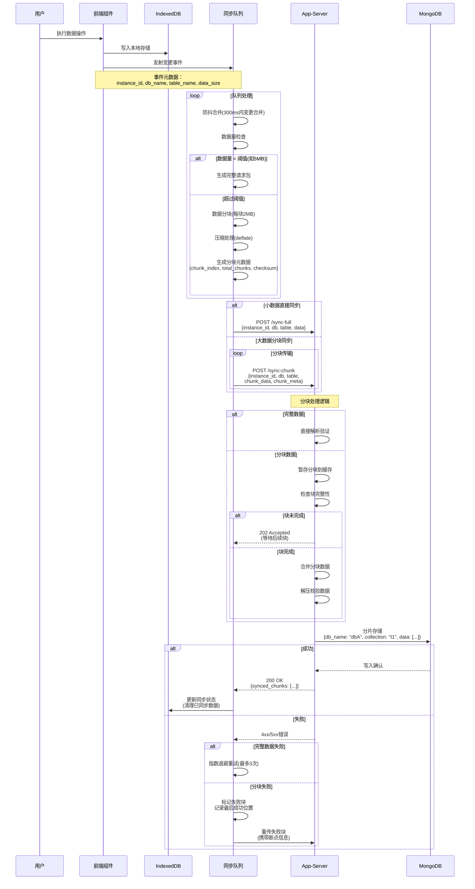

```mermaid

sequenceDiagram
    participant 用户 as 用户
    participant 组件 as 前端组件
    participant IndexedDB as IndexedDB
    participant 队列 as 同步队列
    participant 后端 as App-Server
    participant MongoDB as MongoDB


    用户->>组件: 执行数据操作
    组件->>IndexedDB: 写入本地存储
    组件->>队列: 发射变更事件
    Note over 组件,队列: 事件元数据：<br/>instance_id, db_name, table_name, data_size

    loop 队列处理
        队列->>队列: 防抖合并(300ms内变更合并)
        队列->>队列: 数据量检查
        alt 数据量 < 阈值(如5MB)
            队列->>队列: 生成完整请求包
        else 超过阈值
            队列->>队列: 数据分块(每块2MB)
            队列->>队列: 压缩处理(deflate)
            队列->>队列: 生成分块元数据<br/>(chunk_index, total_chunks, checksum)
        end
    end

    alt 小数据直接同步
        队列->>后端: POST /sync-full<br/>{instance_id, db, table, data}
    else 大数据分块同步
        loop 分块传输
            队列->>后端: POST /sync-chunk<br/>{instance_id, db, table,<br/>chunk_data, chunk_meta}
        end
    end

    Note over 后端: 分块处理逻辑
    alt 完整数据
        后端->>后端: 直接解析验证
    else 分块数据
        后端->>后端: 暂存分块到缓存
        后端->>后端: 检查块完整性
        alt 块未完成
            后端-->>队列: 202 Accepted<br/>(等待后续块)
        else 块完成
            后端->>后端: 合并分块数据
            后端->>后端: 解压校验数据
        end
    end

    后端->>MongoDB: 分片存储<br/>{db_name: "dbA", collection: "t1", data: [...]}
    
    alt 成功
        MongoDB-->>后端: 写入确认
        后端-->>队列: 200 OK<br/>{synced_chunks: [...]}
        队列->>IndexedDB: 更新同步状态<br/>(清理已同步数据)
    else 失败
        后端-->>队列: 4xx/5xx错误
        alt 完整数据失败
            队列->>队列: 指数退避重试(最多3次)
        else 分块失败
            队列->>队列: 标记失败块<br/>记录最后成功位置
            队列->>后端: 重传失败块<br/>(携带断点信息)
        end
    end

```