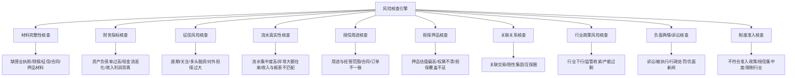

```mermaid
flowchart TD
    A["风险核查引擎"] --> B["材料完整性核查"]
    A --> C["财务指标核查"]
    A --> D["征信风险核查"]
    A --> E["流水真实性核查"]
    A --> F["授信用途核查"]
    A --> G["担保押品核查"]
    A --> H["关联关系核查"]
    A --> I["行业政策风险核查"]
    A --> J["负面舆情/诉讼核查"]
    A --> K["制度准入核查"]

    B --> B1["缺营业执照/财报/征信/合同/押品材料"]
    C --> C1["资产负债率过高/现金流恶化/收入利润背离"]
    D --> D1["逾期/关注/多头融资/对外担保过大"]
    E --> E1["流水集中度高/异常大额往来/收入与报表不匹配"]
    F --> F1["用途与经营范围/合同/订单不一致"]
    G --> G1["押品估值偏高/权属不清/担保覆盖不足"]
    H --> H1["关联交易/隐性集团/互保圈"]
    I --> I1["行业下行/监管收紧/产能过剩"]
    J --> J1["诉讼/被执行/行政处罚/负面新闻"]
    K --> K1["不符合准入政策/授信集中度/限制行业"]
```